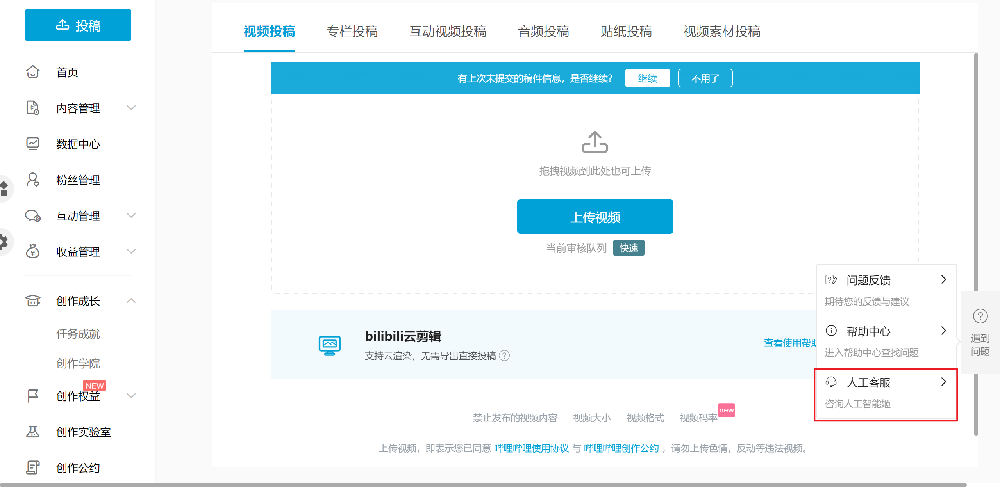
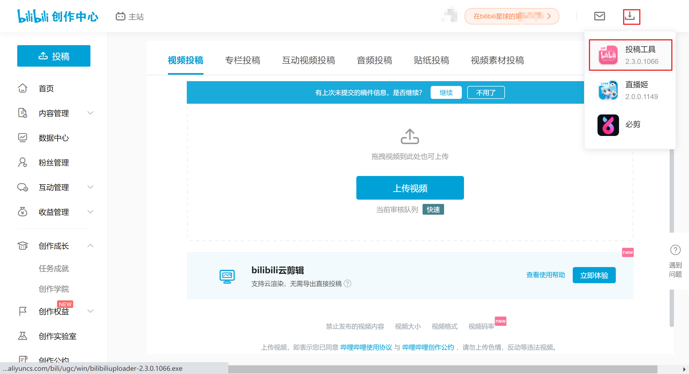

- [投稿方式](#投稿方式)
- [转载与自制](#转载与自制)
- [分p](#分p)
- [分区和标签](#分区和标签)
- [b站视频推送机制](#b站视频推送机制)

### 投稿方式

[网页投稿](https://member.bilibili.com/platform/upload/video/frame)

[b站投稿工具投稿](#分p)（可以分p，投稿互动视频）

### 转载与自制

转载是没有收益的，在开通了创作激励后，自制才有收益。查看某一个视频是自制还是转载的方法是自制视频可以投两个币，转载视频只能投一个币。如果视频简介处有`未经作者授权，禁止转载`这几个字，一定是自制，没有就不一定

b站官方给出的转载与自制区别

录播和带弹幕的录播属于转载，歌曲加字幕属于转载，二刀流剪辑属于转载，倒放属于转载，特效剪辑属于自制，配音属于自制。杂谈回游戏回加字幕严格意义上来说属于转载，投自制也可以。关于转载与自制，我的理解是看视频的主体是什么，比如一个MAD/AMV，即使是纯片段的截取，但是创作者加入了自己的理解，属于自制

点击[投稿页面](https://member.bilibili.com/platform/home)的人工客服了解更多

### 分p

下载b站投稿工具可以分p，投稿互动视频。我用b站投稿工具上传视频比网页版上传慢，不知道是不是我自己的问题

### 分区和标签

分区是动画综合，标签参考其他切片，听说打上asoul标签会被限流。

### b站视频推送机制

https://www.douban.com/group/topic/255649682/?_i=3700324RMhUFsw
