- [ffmpeg下载及配置](#ffmpeg下载及配置)
  - [ffmpeg下载](#ffmpeg下载)
  - [配置环境变量](#配置环境变量)
  - [在某一目录下使用ffmpeg](#在某一目录下使用ffmpeg)
- [cmd输入的小技巧](#cmd输入的小技巧)
  - [执行命令](#执行命令)
  - [Tab键补全文件名](#Tab键补全文件名)
  - [复制粘贴](#复制粘贴)
  - [快速运行历史命令](#快速运行历史命令)
  - [清屏](#清屏)
  - [输入习惯](#输入习惯)
- [ffprobe的使用](#ffprobe的使用)
- [ffmpeg命令（不转码）](#ffmpeg命令（不转码）)
  - [停止命令](#停止命令)
  - [转封装](#转封装)
  - [视频提取音频](#视频提取音频)
  - [视频去掉音频](#视频去掉音频)
  - [视频粗剪](#视频粗剪)
  - [音频剪辑](#音频剪辑)
  - [更换音频](#更换音频)
  - [拼接视频](#拼接视频)
- [ffmpeg命令（转码/压制）](#ffmpeg命令（转码/压制）)
  - [什么是转码](#什么是转码)
  - [一些参数和模式的含义](#一些参数和模式的含义)
    - [preset](#preset)
    - [crf](#crf)
    - [abr](#abr)
    - [2pass](#2pass)
  - [模式的选择](#模式的选择)
  - [压制实例分析](#压制实例分析)
  - [字幕压制](#字幕压制)
    - [ffmpeg压制](#ffmpeg压制)
    - [pr插件](#pr插件)
  - [弹幕压制](#弹幕压制)
    - [截取录播与弹幕](#截取录播与弹幕)

### ffmpeg下载及配置

#### ffmpeg下载

[ffmpeg官网下载](https://ffmpeg.org/download.html)

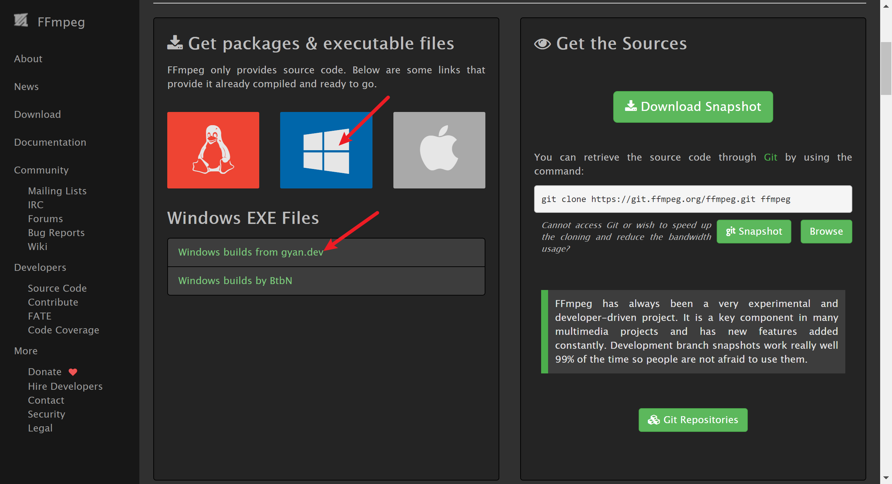

鼠标移动到Windows图标，点击上面这个。其实下面这个也行，区别就是不同的人用同一种源码编译的，不过GitHub不用[加速下载](http://shrill-pond-3e81.hunsh.workers.dev/)网站的话下载比较慢

往下拉，下载这个，下载后解压

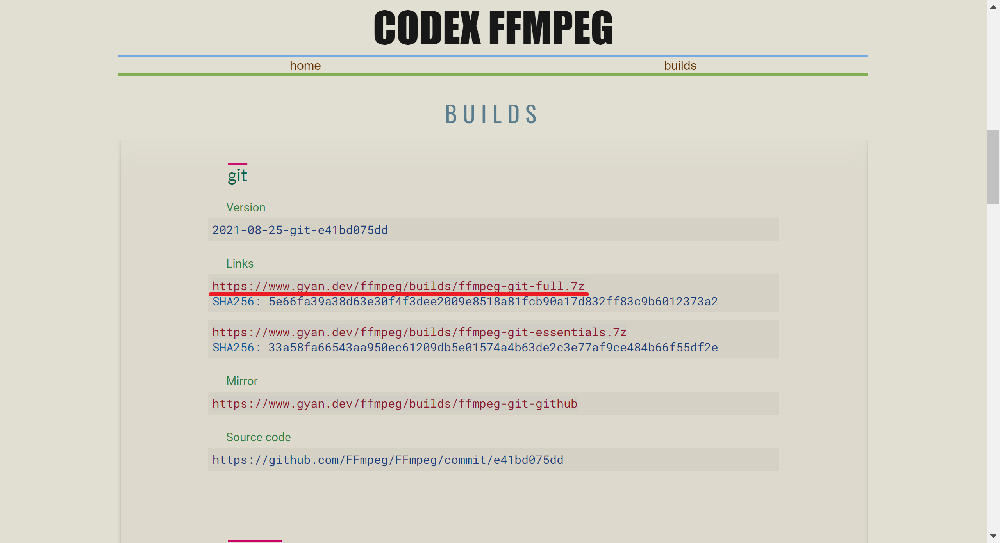

#### 配置环境变量

配置环境变量是为了在任何地方调用ffmpeg

把解压后的文件夹移动到一个不会被误删的地方，如c盘

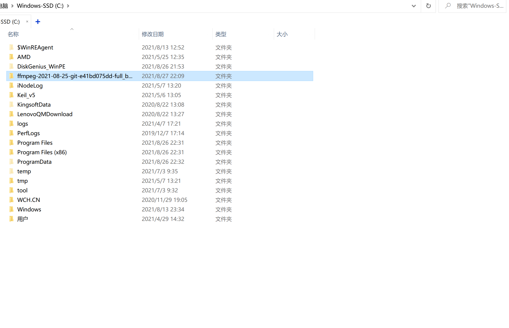

打开解压后的文件夹，进入bin文件夹内，ffmpeg是转封装转码用的，ffplay是一个简易的播放器（播放的默认画质很差），[ffprobe](#ffprobe的使用)是查看音视频详细信息的

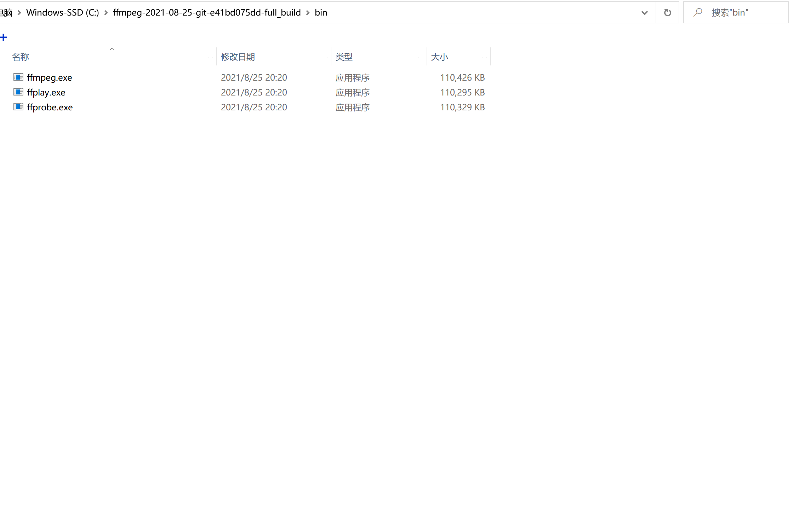

选择bin目录下三个exe文件的任意一个，右键，属性，把位置完整复制下来

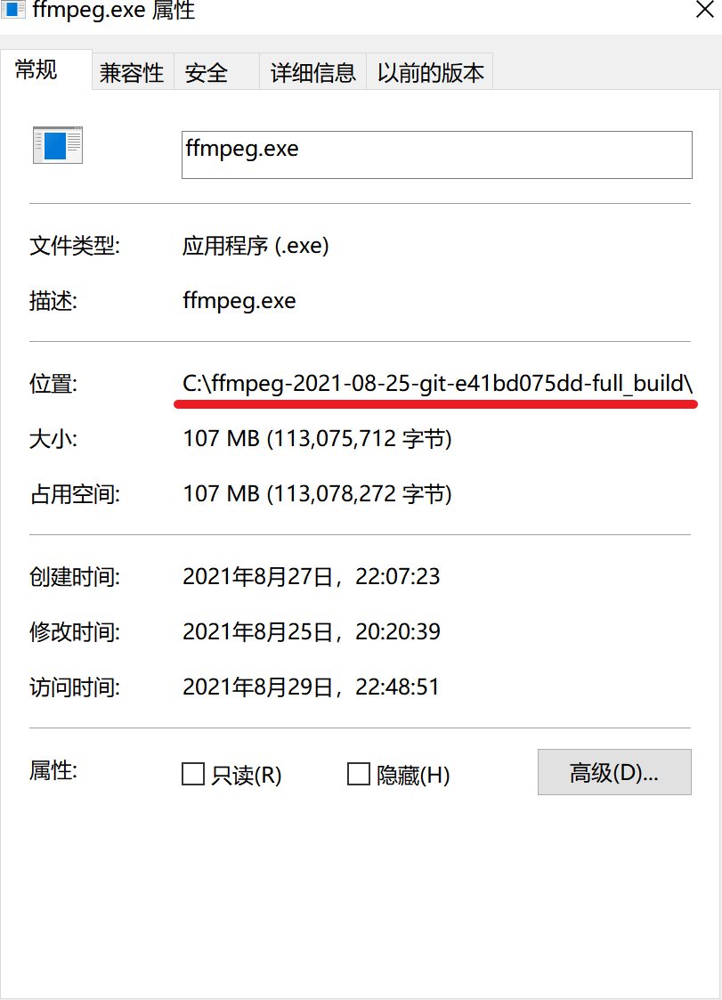

来到桌面，单击此电脑，右键，属性，高级系统设置

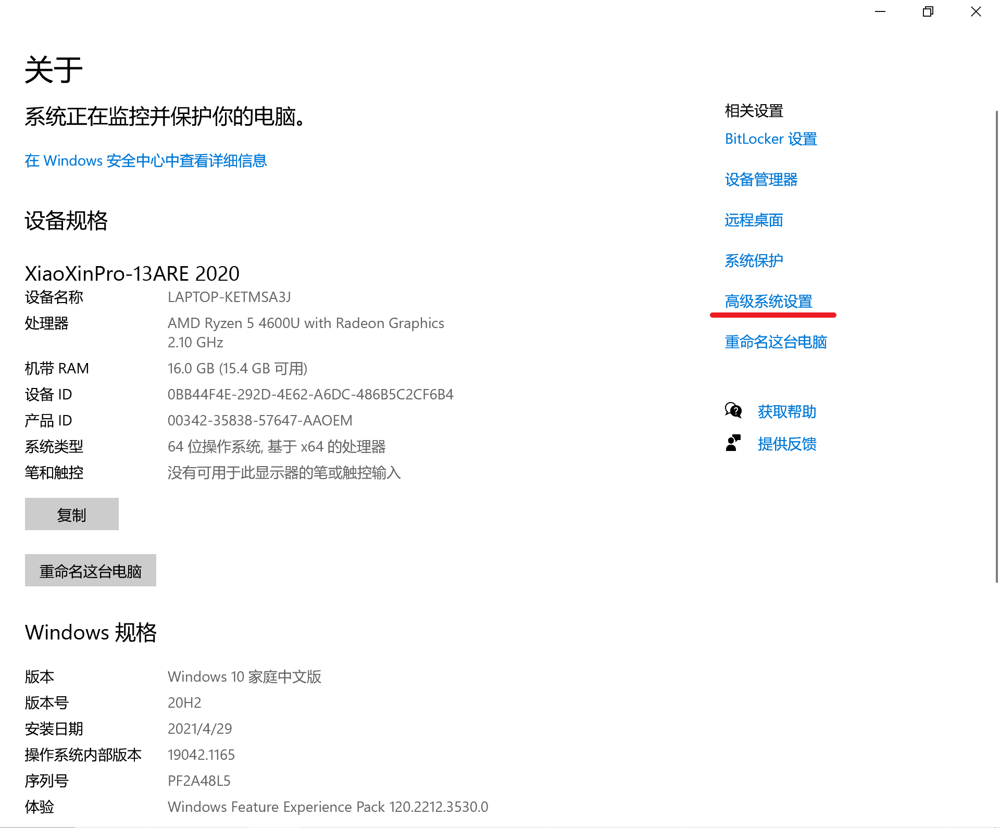

点击环境变量

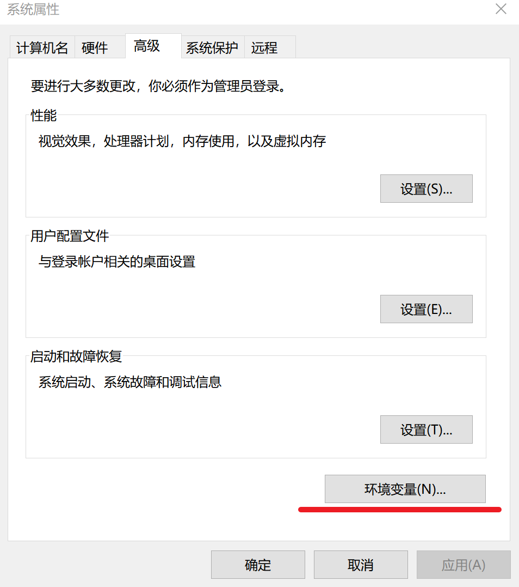

双击Path

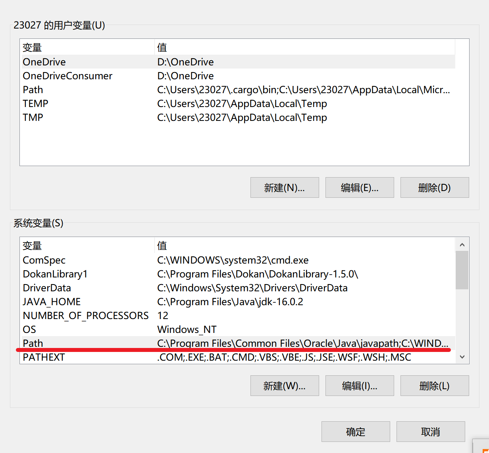

点击新建，粘贴路径，一路确定即可

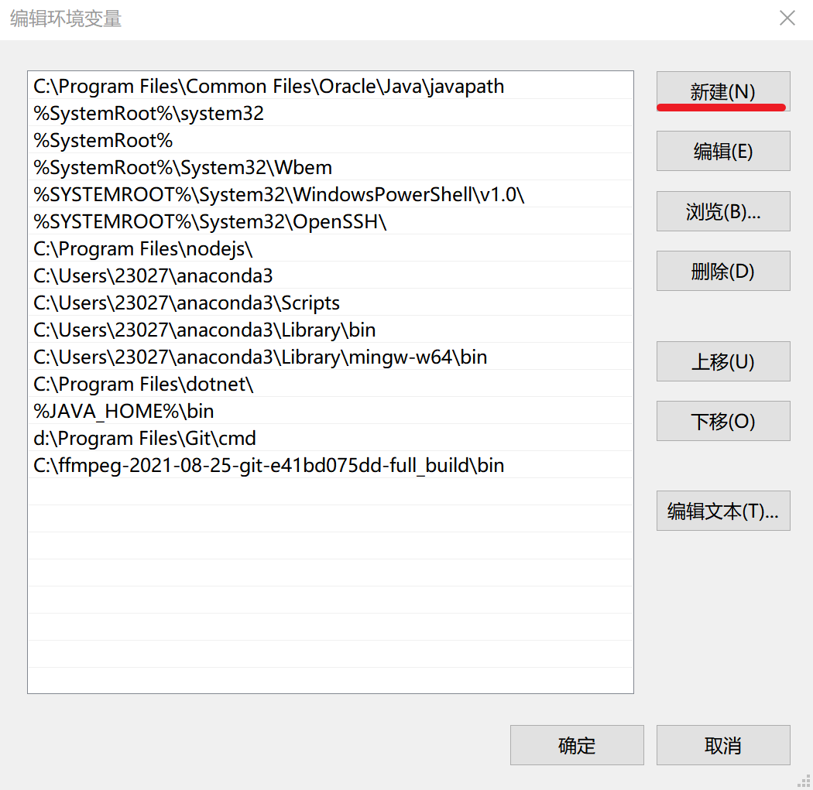

快捷键Windows+R，输入cmd，回车

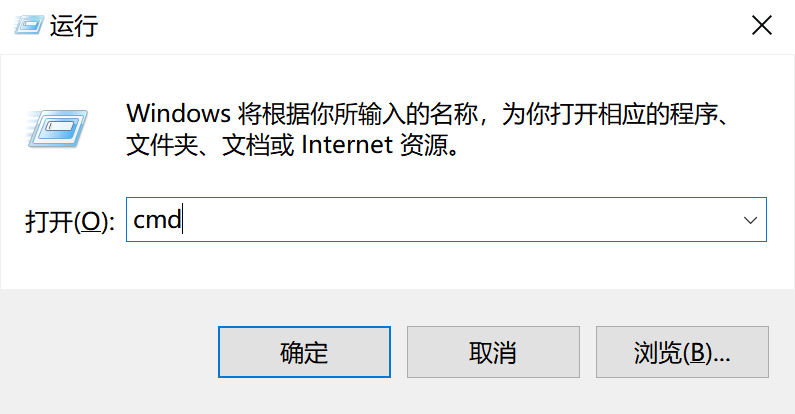

输入命令

```
ffmpeg -version
```

回车，出现如图所示的画面即配置成功


#### 在某一目录下使用ffmpeg

打开音视频所在目录，用鼠标单击箭头所指的地方（鼠标指针在黑线间）

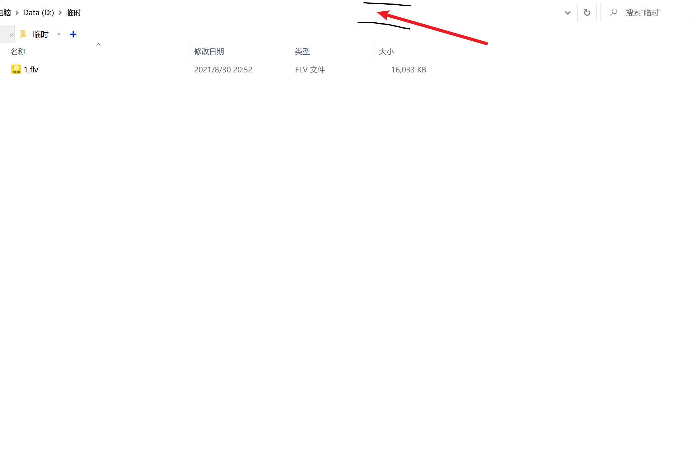

路径变蓝

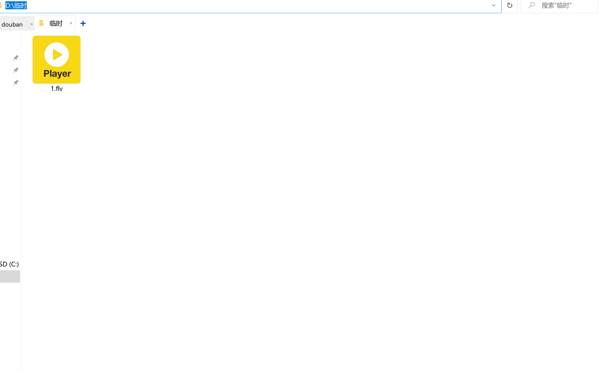

输入cmd，回车

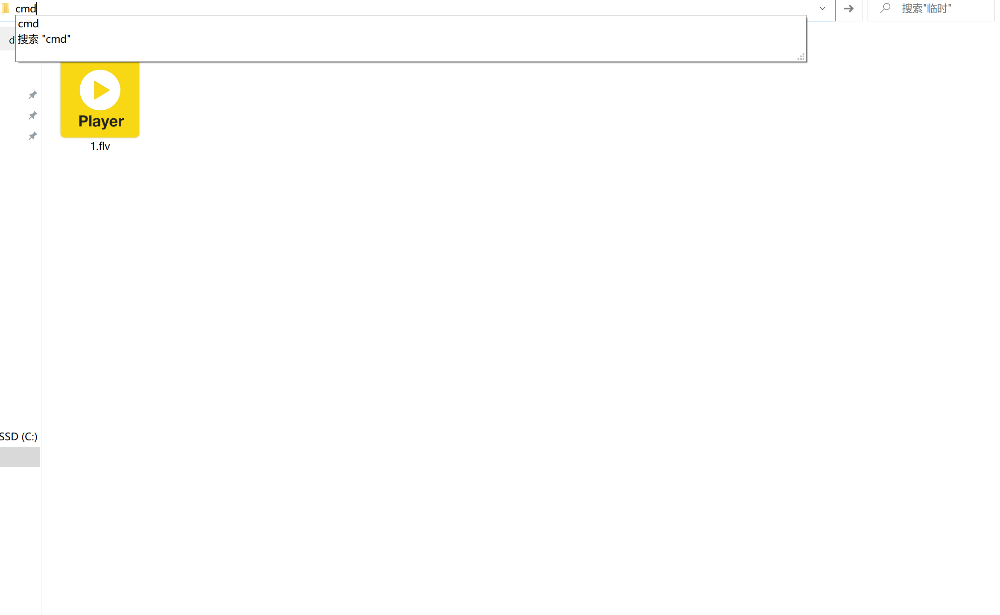

成功在某一目录下打开cmd窗口。==后面的所有代码都是在需要处理的视频目录下打开cmd窗口为前提==

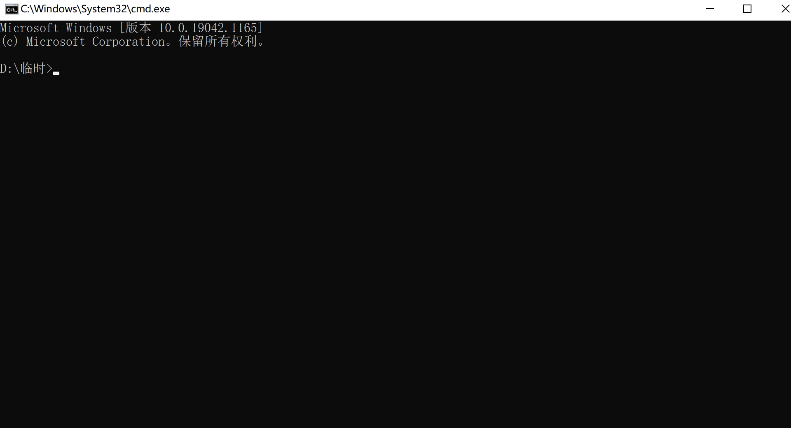

### cmd输入的小技巧

#### 执行命令

输入命令后按回车执行

#### Tab键补全文件名

如果目录下有多个文件，输入想转换的文件名时，只需要输入文件名的前面几个字再按键盘上的Tab键即可自动补全。如想输入232555.flv，输入2，因为同一个目录下只有一个2开头的文件，所以按下Tab键自动补全232555.flv。假如目录里有三个2开头的文件21.flv, 22.flv, 23.flv，输入2后按Tab键补全为21.flv ，此时需要再次按Tab键，变为22.flv，再按Tab键，变为23.flv，继续按Tab键，变为21.flv。这种情况多输入几个字，如23，按Tab键补全为23.flv

==如果复制了一串命令，粘贴到命令行，想把命令开头的input.flv改成其他文件，千万不能按Tab键，一按Tab键自动补全，文件名补全了，但是后面的一串命令没了==


#### 复制粘贴

在cmd中按住鼠标左键选中文字，Ctrl+C复制，Ctrl+V粘贴或者鼠标右键点击粘贴。注意，在运行命令的时候（如用ffmpeg转码中）按Ctrl+C强制中断命令（已经转换的部分不会丢失），ffmpeg在执行命令的过程中可以按键盘的q键停止

#### 快速运行历史命令

假如刚才输入了一串很长的命令，如（压制字幕命令）

```
ffmpeg -i input.flv -c:v libx264 -c:a copy -vf subtitles=input.ass -crf 17 -preset 7 output.mp4
```

处理了一个视频，又想处理同一目录下的另外一个视频，此时不要关闭cmd窗口，按键盘的"↑"键自动输入（不自动执行，需要手动按回车执行）上一条执行过的命令，"↓"键自动输入（不自动执行，需要手动按回车执行）下一条执行过的命令

#### 清屏

输入cls，回车，清屏。历史命令是不会清除的，除非关闭cmd窗口

#### 输入习惯

不需要输入中文的时候，建议用英文键盘输入命令，避免出错，需要用中文再切换输入法。文件名如果有特殊字符，差不多就是除开中文英文数字下划线（_）短杆（-）的字符，建议重命名或者用英文双引号把文件名引起来（"文件名"）

### ffprobe的使用

为了转换不会出错，同时更加深刻认识转换的原理，转换之前建议用ffprobe查看一下音视频的信息

当然，PotPlayer播放时按Tab键也可以看到音视频信息，把音视频拖动到[小丸工具箱](./杂篇.md#小丸工具箱)的MediaInfo也可以，其他软件也可以看到音视频的信息

```
ffprobe input.flv
```

第一行分别是视频格式，分辨率，码率，帧率，第二行分别是音频格式，采样率，码率，对这些名词不熟悉建议看[音视频知识](./音视频知识.md)

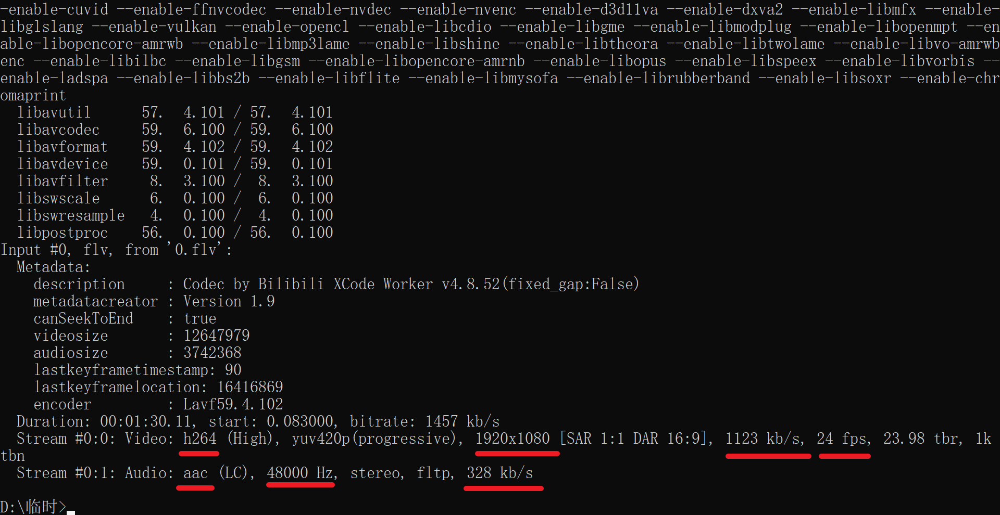

### ffmpeg命令（不转码）

#### 停止命令

在ffmpeg执行命令的过程中，按键盘上的q键可以停止

#### 转[封装](./音视频知识.md#封装格式)

当软件不支持某一种封装格式的时候需要转封装，如flv格式的视频不能直接导入pr、Aegisub等软件。转封装的速度非常快，占用的cpu和硬盘资源较少，几小时的视频几秒就处理完了（具体时间与cpu和硬盘性能有关）

flv转mp4命令（不同视频封装格式一般可以互相转换，flv与mp4可以替换为其他格式）

```
ffmpeg -i input.flv -c copy output.mp4
```

-i后面接的是需要处理的文件，文件名按照实际替换，-c指的是所有编码器，copy，直接复制，也就是不转码，-c copy的意思是视频、音频、字幕等都不作处理，输出的文件写在最后面，文件名与封装格式按照实际替换。因为是在当前目录打开cmd，所以输入和输出的文件都在同一个目录下，如果想输出到某一个目录，如d盘下的视频文件夹，`output.mp4`变为`D:\视频\output.mp4`（注意切换到英文键盘输入"\\"与":"），同理，输入的文件也可以在任意一个目录，只需带上完整路径即可

#### 视频提取音频

也就是俗称的视频转音频

```
ffmpeg -i input.flv -vn -c:a copy output.m4a
ffmpeg -i input.flv -vn -c:a copy output.aac
```

两种代码都可以，一般转为m4a。转换之前建议看看视频里[音频的格式](#ffprobe的使用)，大多数视频里面的音频格式都是AAC，转m4a与转AAC都没有问题

-vn表示去掉视频，-c:a是音频编码器，copy，直接复制，-c:a copy就是音频不转码的意思

如果某些老旧的设备或者软件兼容性比较差，音频转为mp3格式。如果视频里面的音频本来就是mp3格式，那就不用转码了，直接-c:a copy就行

```
ffmpeg -i input.flv -vn -c:a libmp3lame -ar 44100 -ab 320k -ac 2 output.mp3
ffmpeg -i input.flv -vn -c:a libmp3lame -ab 320k output.mp3
```

上面的代码为完整版，下面的代码为简化版，比特率默认是128k，所以想转换成320k码率的mp3一定要设置。mp3的最高码率是320k，常见的码率有128k，192k，320k。转换成什么码率看原来是什么码率左右，一般转成常见码率，如果写成300k，310k的话自动转成320k，有些码率是转换不了的，视频里面的音频的码率一般是在128k，192k，320k上下浮动，不会是一些奇奇怪怪的码率

-vn表示去掉视频，-c:a是音频编码器，用libmp3lame编码，音频从原来的格式[转码](#什么是转码)变成了mp3格式，-ar后面是采样率，一般是44100Hz或者48000Hz，-ab后面是比特率，-ac后面是声道数，一般视频是双声道，电影有多个声道

#### 视频去掉音频

```
ffmpeg -i input.flv -an -c:v copy output.flv
```

-an表示去掉音频，-c:v表示视频编码器，copy，直接复制，-c:v copy表示视频不转码，output.flv可以换成output.mp4，去掉音频与转封装结合

#### 视频粗剪

ffmpeg可以粗剪视频（在关键帧处剪断，可能有几秒误差），速度很快，无损剪辑

```
ffmpeg -ss 00:10:05 -to 00:10:15 -accurate_seek -i input.flv -c copy -avoid_negative_ts 1 output.flv
ffmpeg -ss 00:10:05 -t 10 -accurate_seek -i input.flv -c copy -avoid_negative_ts 1 output.flv
```

两种代码效果一样，都是剪10秒的视频，-ss后面是开始时间，-to后面是结束时间，-t后面是往后剪的秒数，-accurate_seek加速寻找关键帧，-c copy是音视频都不转码，-avoid_negative_ts 1字面意思是避免错误的时间戳（avoid negative time stamp），1是不避免，不加这一句的话有时剪出来前面有几秒有画面没有声音

ffmpeg会剪到关键帧上，如果视频的关键帧每5秒一个，开始时间与结束时间刚好在两个关键帧的中间，-ss，-to，-t在-i前面，没有剪到关键帧的话ffmpeg会剪到最近的前面一个关键帧，导致开始时间和结束时间都早了2.5秒。如果视频每秒1个关键帧，剪出来的视频可以精确到秒

#### 音频剪辑

音频剪辑比较精确，误差一秒左右，影响不大

```
ffmpeg -ss 00:00:00 -to 00:01:29 -i input.m4a -c copy output.m4a
ffmpeg -ss 00:00:00 -t 89 -i input.m4a -c copy output.m4a
```

两种代码效果一样，-ss 00:00:00表示从音频的0秒开始，-to 00:01:29表示剪到1分29秒，-t 89表示往后剪89秒-c copy因为是音频，可以换成-c:a copy，-c copy更简单

#### 更换音频

就是把视频原来的声音换成其他声音，比如换个bgm，不过换音频用pr更简单，ffmpeg比较麻烦但是换音频是没有损耗的，即没有经过转码，换音频速度更快

第一步，把视频去掉音频，参考[视频去掉音频](#视频去掉音频)

第二步，把另外一段音频剪到跟视频的时长一样，参考[音频剪辑](#音频剪辑)

第三步，视频与音频组合

```
ffmpeg -i input.flv -i input.m4a -c copy output.flv
ffmpeg -i input.flv -i input.flac -c copy output.mkv
```

注意mp3格式，aac格式，m4a格式的音频可以封装到flv或者mp4，flac格式的音频只能封装到mkv

#### 拼接视频

在视频所在目录右键新建一个txt文件，名字随意，这里命名为input.txt。打开txt文件，按拼接顺序输入视频的路径，格式如下

 ```
 file 'D:\xxx\xxx\input1.flv'
 file 'D:\xxx\xxx\input2.flv'
 file 'D:\xxx\xxx\input3.flv'
 ```

一行一个文件，用英文单引号把路径引起来，file后面有个空格，保存文件

cmd输入合并命令

```
ffmpeg -f concat -safe 0 -i input.txt -c copy output.flv
```

如果没有-safe 0，ffmpeg会警告文件不安全，拼接失败，-f concat，f是format的缩写，格式的意思，concat是一种拼接的方式，文件的路径已经写入txt文件里面了，所以输入txt文件即可，-c copy不转码，直接合并

### ffmpeg命令（转码/压制）

#### 什么是转码

把视频或音频[解码](./音视频知识.md#解码)再重新编码叫做转码，一般转码是为了缩减视频体积，所以也叫压制，但是转码之后视频不一定会变小。字幕组通过压制把几十G的蓝光原盘压制成几个G。也可以通过压制把字幕和水印等压进视频里面，变成视频画面不可分割的一部分

如果输入这条命令，就会以默认的参数转码

```
ffmpeg -i input.flv output.mp4
```

因为没有设置编码器，所以会有一个警告，ffmpeg会自动选择编码器，这个警告无所谓。ffmpeg默认输出的音频的比特率是128k，所以output.mp4的音频比特率是128k，由于没有指定音频编码器和音频格式，所以音频格式不变，音频进行了重新编码，质量下降。ffmpeg默认视频是以crf模式压制的，crf值是23，preset默认的值是5，此时视频质量主要受到crf值影响，preset的值也有一点影响，转码后的视频质量下降。压制的速度主要受到preset的值影响，压制速度较快

#### 一些参数和模式的含义

##### preset

- ultrafast     0 
- superfast   1
- veryfast     2
- faster         3
- fast            4
- medium     5
- slow           6
- slower        7
- veryslow     8
- placebo      9

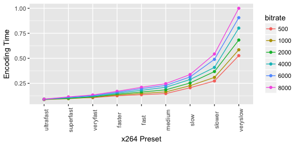

preset参数是x264，x265编码器为了操作简单内置的预设，preset的值与编码时间关系很大，对视频的质量也有影响，preset参数取值看上表，用左边的英文或者右边的数字都可以，placebo是几乎无损，但是编码时间太长了，没有必要用placebo。veryslow编码时间比placebo快几十倍，veryslow编码质量质量比placebo降低1%，slower编码时间大概是veryslow的一半，slower编码质量比veryslow降低3%，slow编码时间大概是slower的三分之二，slow编码质量比slower降低5%，medium编码时间更短，medium编码质量比slow降低5%-10%。preset的值（指数字）越小，编码生成的视频文件就会大一些，画质降低，编码速度加快

preset值选择看需求，如果更追求画质，转码时间长无所谓，用veryslow（8），如果想画质又好速度又快，用slower（7），如果不太追求质量，想快点转码，用slow（6）或者medium（5）

##### crf

crf全称Constant Rate Factor，用crf的值表示压制出来视频的质量。crf的值可以有一位小数，x264_8bit的crf值范围是0-51，x264_10bit的crf值范围是0-63，x264编码器默认crf值是23，x265_8bit和x265_10bit编码器的crf范围都是0-51，默认crf值都是28，x264的crf23效果等同于x265的crf28。crf的值越小，质量越高，crf的值越大，质量越低。crf的值是17或者18时，压制后的视频与原视频已经看不出区别（实际上压制后是有损的）。crf的推荐值为17-28，crf的值与视频质量成指数关系，crf的值增加6，视频码率大概变为原来的一半。经过测试，10M码率的视频，crf17压制后视频码率约为7M，crf23压制后视频码率约为3.5M

设置好一个crf值后，编码器根据视频的实际情况动态决定码率。比如一个视频前半部分是一段内容简单的画面，后半部分是一段内容复杂的画面，在压制的时候，前半部分的码率分配较少，后半部分的码率分配较多。crf的优点是让编码器动态分配码率，注重所有画面的质量，缺点是不能控制压制出来的视频体积大小

简单来说，crf模式是设定一个代表画质数字，让编码器决定码率，压制后的视频大小未知

##### abr

abr，Average Bit Rate，平均码率模式，自主选择一个码率所为目标，例如想控制5000k码率，用`-b:v 5000k`或者`-b:v 5M`参数控制。如果原视频的码率前后差异很大，用abr压制效果会很差

一部动作电影往往结尾的场景比较复杂（特效多、打斗多），如果用了cbr模式，编码器从视频的开头开始压制，无法预测后面的场景有多么复杂。假设压制一部动作电影，目标码率是5M，编码器可能一开始把电影的前面压到4M，因为开头的场景不复杂，动态场景也不多。虽然4M码率与目标5M码率有差距，但是编码器并不会立即拉高码率，而是会根据当前帧画面的复杂程度考虑下一帧画面的复杂程度，何况电影时长这么长，没有必要因为暂时低于目标码率马上就拉高码率，如果前面一段时间（时间究竟多长取决于编码器的算法）画面都是非常简单的画面，一直分配低于5M码率，编码器就慢慢把码率拉高，拉到6M，这样刚好达到目标5M的平均码率，如果这时出现小高能画面，特效和运动场景非常多，编码器可能会把码率拉到9M，等到小高能过了再把码率拉低，总之在某一段时间内（取决于算法），平均码率不断地控制为5M，平均码率低于5M就慢慢拉高，高于5M就慢慢拉低。等到电影进入到结尾的高能时刻，坏了，前面的码率已经平均到5M了，后面想拉高也拉高不了，导致结尾特效多，运动多的场景很糊

简单来说，cbr将视频的码率控制在一个可自由调节的值附近，由于编码器没有整体预览一次视频，只能根据经验不断地调高调低，将码率控制为某一个值

把珈乐的一段原码率为10M的30s录播压成2M码率，然后把两段视频拼接在一起，做成一个前后码率差异巨大的1分钟视频。下图是整段视频的码率分析，用的软件为Bitrate Viewer（可在本仓库的git目录里找到）

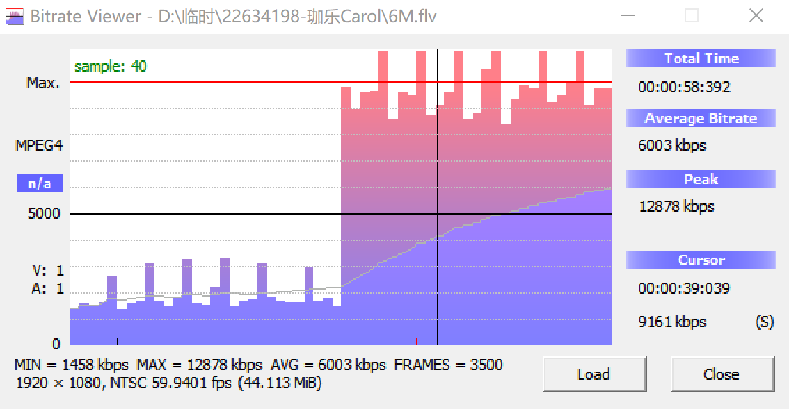

用crf17（视觉无损）压了一次，码率大概为5M，结果如下图，可见码率的大致分布于原视频差不多

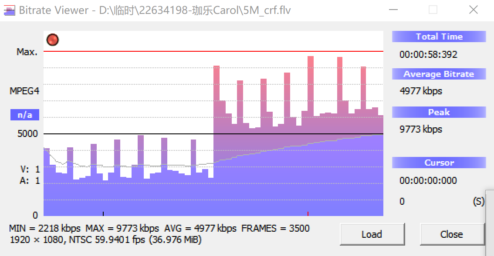

用恒定5M码率压了一次，码率分布如下图。可见前半部分码率过高，而且差不多一直平均在5M码率左右，浪费了码率，中间码率突然升高，码率飙升，结尾因为平均码率超过5M，码率被拉低，结果还是超出了5M的码率

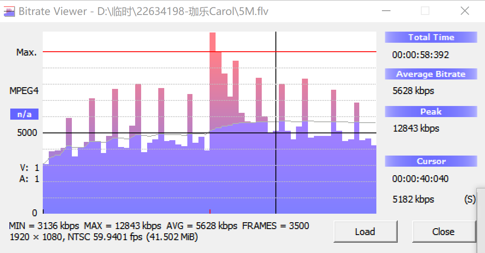

下图是用[2pass](#2pass)模式压制的码率分配比bitrate模式好，但是因为原视频码率差异太离谱了，所以码率分配还是不太理想，中间码率突变的时候码率拉得太高了，结尾码率强行拉低，向目标码率靠拢。实际上，不断地重复压制，n次压制后得到的码率分布趋向crf

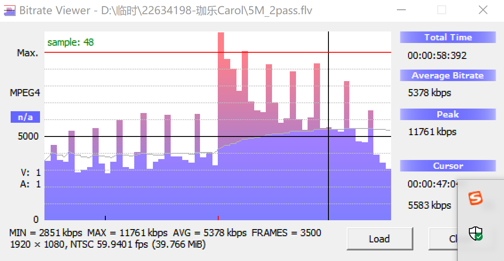

##### 2pass

1pass是压制一次，2pass可以理解为压制两次，第一遍快，目的是“看一遍”视频，弄清视频的码率分布情况，第二遍就根据第一遍得到的数据控制码率。2pass的目的是在一定码率的限制下向crf靠拢

2pass压制第一次的时候生成两个记录视频数据的文件，也可以生成视频文件，第一次完成后打开视频看一下，如果满意就不必进行第二次压制了。第二次压制的时候编码器根据第一次生成的数据文件决定码率分配

2pass压制第一次的时候可以用crf模式或者bitrate模式，默认是crf模式，如果视频码率变化大建议用crf模式，更加贴合码率的变化，如果视频码率变化不大用哪个都可以。2pass第一遍用crf模式和bitrate模式时间是几乎是一样的，默认使用快速压制参数。2pass第二次的时候就不能用crf模式了，只能用bitrate模式

#### 模式的选择

如果目标是控制压制后视频的大小，而原视频前后的码率变化较大，选择2pass。crf虽然适用于前后码率变化大的视频，crf的值增加6压制后视频的大小减半，但是对一个视频第一次使用crf模式压制，生成视频的大小是不能准确预测的。如果对视频的大小没有要求，用crf。如果原视频的码率较为平缓，如A-SOUL的录播，使用bitrate模式也没有问题

#### 压制实例分析

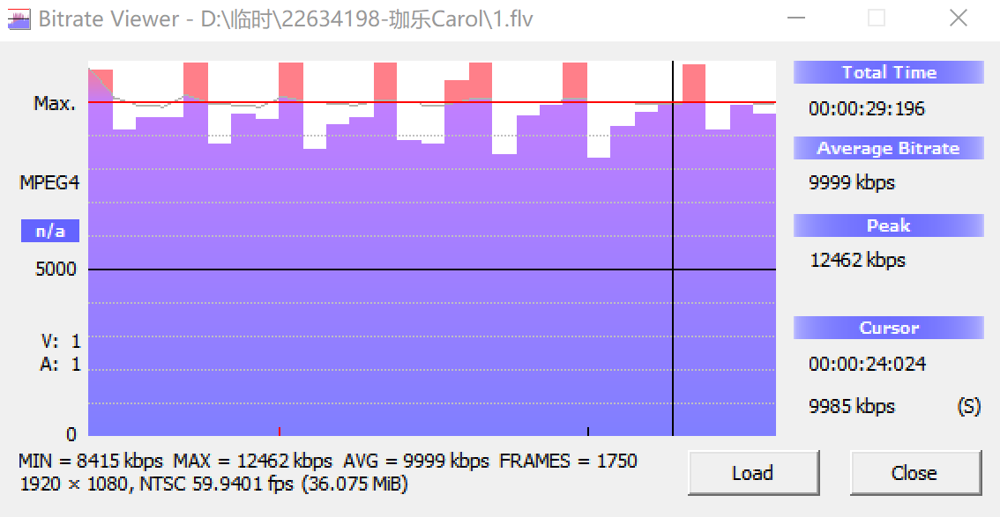

上图为原视频（珈乐的一场录播中的30秒）码率分布图，b站直播采用cbr模式，直播10M码率，实际上码率会上下波动

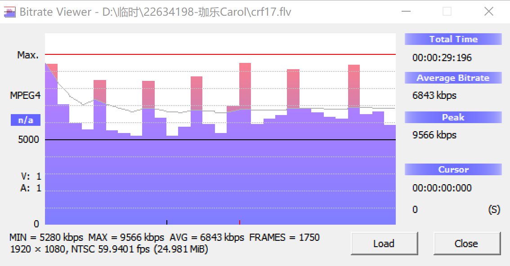

上图采用的命令为

```
ffmpeg -i input.flv -c:a copy -c:b libx264 -crf 17 -preset 7 output.flv
```

码率的分配与原视频一致，-crf 17为视觉无损，几乎看不出来与原视频的区别

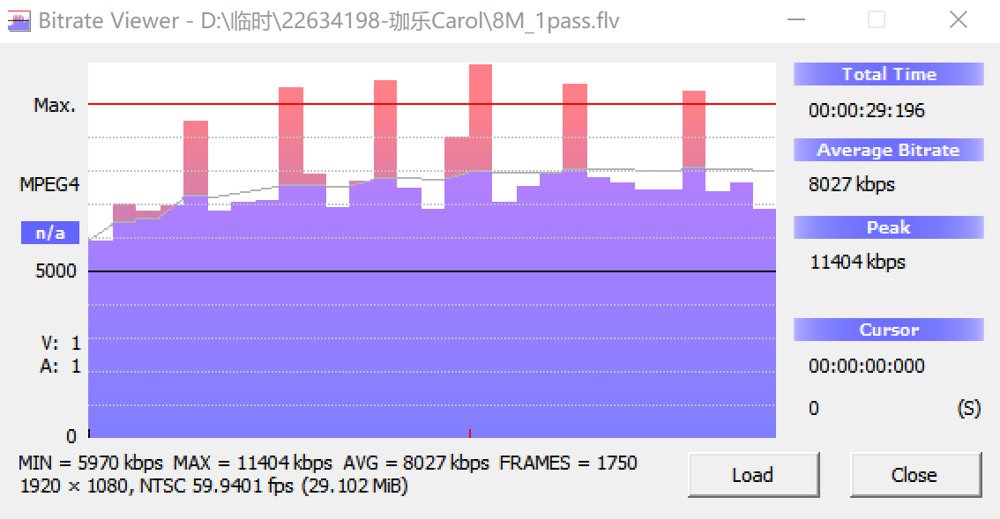

上图采用的命令为

```
ffmpeg -i input.flv -c:a copy -c:v libx264 -b:v 8M -preset 7 output.flv
```

压制后的视频刚开始码率低，因为目标码率是8M，刚开始要保守一点，结尾的码率又变稍微低，因为要向8M的目标码率靠拢。-c:a copy，音频不编码，-c:v libx264，用x264编码器编码，-b:v 8M，目标码率8M，-preset 7，预设值，对压制时间影响很大，对质量略微影响

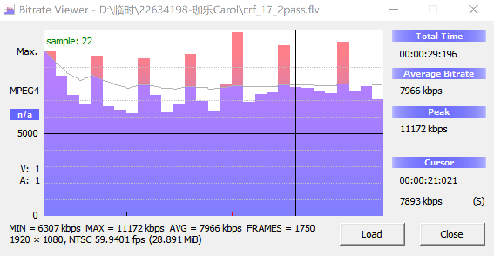

上图采用的命令为

```
ffmpeg -y -i input.flv -an -c:v libx264 -crf 17 -preset 7 -pass 1 -f null NUL && ffmpeg -i 1.flv -c:a copy -c:v libx264 -b:v 8M -preset 7 -pass 2 output.flv
```

看起来很长，实际上是两条命令合并在一起，&&是cmd的语法，表示先执行前面的命令，执行成功后才会执行后面的命令。第一遍用了-an，因为音频不用转码，不用分析音频的码率，用-c:a copy也没有问题。-f null表示生成的文件类型为空，NUL表示一个空文件，使用-y是因为ffmpeg可能会询问已经存在NUL文件，是否覆盖，如果不写-y，可能需要手动输入y然后回车才能执行命令。第一遍用crf模式，不生成文件。如果想第一遍生成文件，把-f null NUL改成temp.flv。（名字与封装格式随意）-pass 1表示第一次2pass，默认用了快速参数，需要的时间比第二次少，生成记录视频码率数据的文件，-pass 2表示第二次2pass，只能用bitrate模式，毕竟2pass相当于有目标码率的crf模式

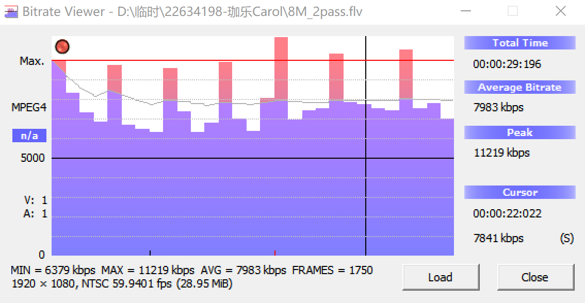

上图采用的命令为

```
ffmpeg -y -i input.flv -an -c:v libx264 -b:v 8M -preset 7 -pass 1 -f null NUL && ffmpeg -i 1.flv -c:a copy -c:v libx264 -b:v 8M -preset 7 -pass 2 output.flv
```

相比上一条命令，区别在于第一次用bitrate模式，由于原视频码率变化不大，crf和2pass的码率分布几乎一样

#### 字幕压制

##### ffmpeg压制

b站录下来的是xml弹幕，需要[转换](./录播.md#xml弹幕转ass弹幕)为ass弹幕才能压制

把ass弹幕文件和视频文件放在同一个目录下，输入命令

```
ffmpeg -i input.flv -c:a copy -c:v libx264 -b:v 14M -vf subtitles=input.ass -preset 7 output.flv
ffmpeg -i input.flv -c:a copy -c:v libx264 -crf 17 -vf subtitles=input.ass -preset 7 output.flv
```

因为asoul的录播是10M码率，码率变化不大，用bitrate模式和crf模式都可以，半屏弹幕14M码率看起来比较清晰，码率上与crf20差不多，如果直接用crf17压制半屏弹幕，压制出来的视频体积几乎是原视频的两倍。下图分别是用crf20,14M，crf17，19M压制出来的视频码率图，四个视频看起来没有什么区别。crf模式前面码率飙升是因为视频开头弹幕从右向左移动，弹幕密度很快达到最大，此后视频码率和弹幕码率可以看作不变，总体码率几乎不变。从下图的顶部的文件名可以看到压制时间随码率的变大而变大，变大的幅度较小，压制时间主要取决于preset


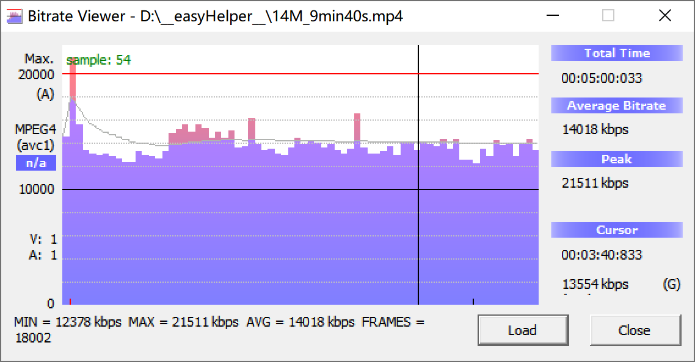


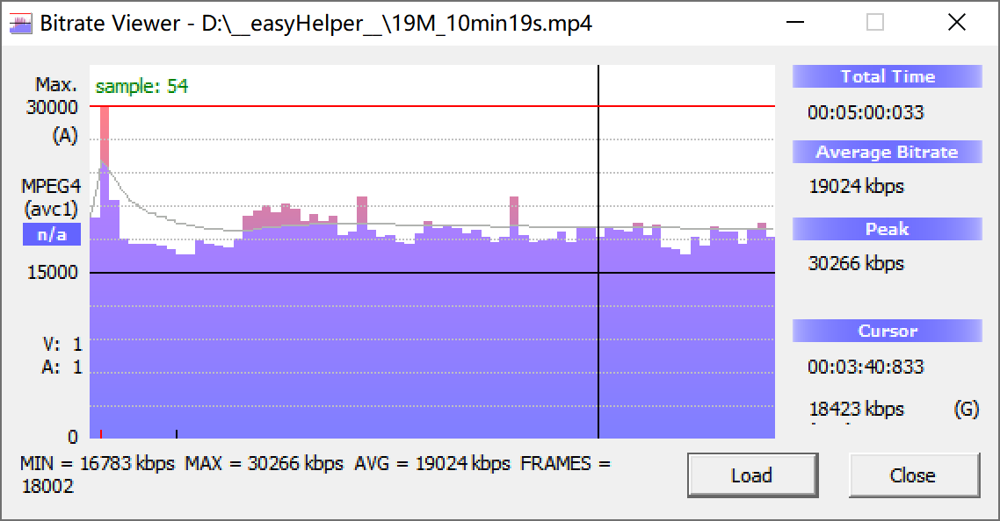

##### pr插件

[Ruminoid官网下载](https://vbox.moe/Ruminoid/)

[Ruminoid官方教程](https://www.bilibili.com/video/BV16K4y1Y7vB)

pr插件有官方教程，我就不多说了，pr导出的时候码率一定要选择适合的码率，原视频10M码率，半屏弹幕压制大约14M

#### 弹幕压制

ffmpeg弹幕压制与[字幕压制](#字幕压制)命令是一样的，第一次压制的时候建议先压制2分钟（至少半分钟）的弹幕，用较短的时间测试一下参数，调节到满意为止

##### 截取录播与弹幕

压制弹幕的时候建议先压制两三分钟的视频看看效果。首先要把录播视频剪几分钟下来，[用ffmpeg可以快速无损剪辑。](./ffmpeg.md#视频粗剪)假设从25分剪到27分，总共两分钟。然后把[xml弹幕转换为ass弹幕](./录播.md#xml弹幕转ass弹幕)，用记事本打开ass弹幕，把除了从25分开始到27分结束的弹幕全部删了，保存，用[Aegisub](./字幕打轴.md)打开


点击平移时间

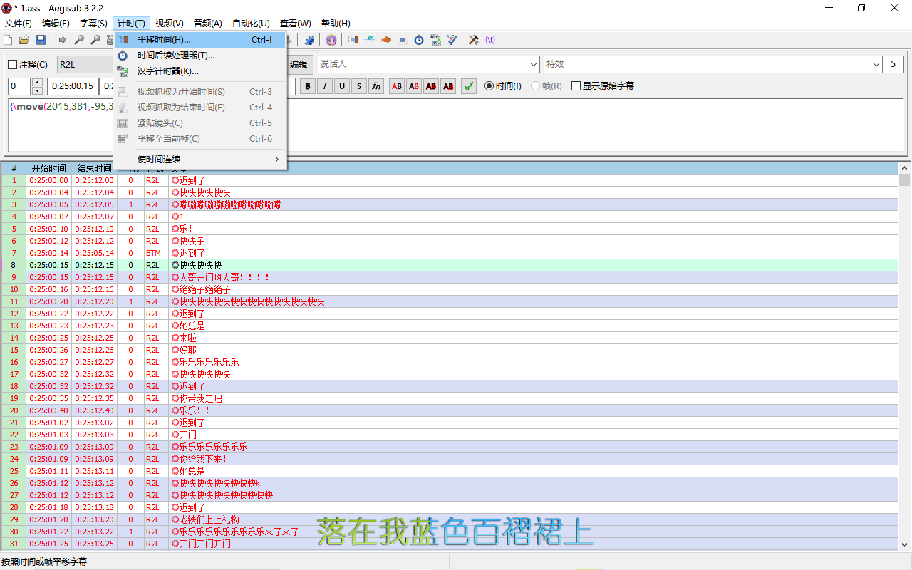

所有行的开始和结束时间提前25分钟，按确定即可

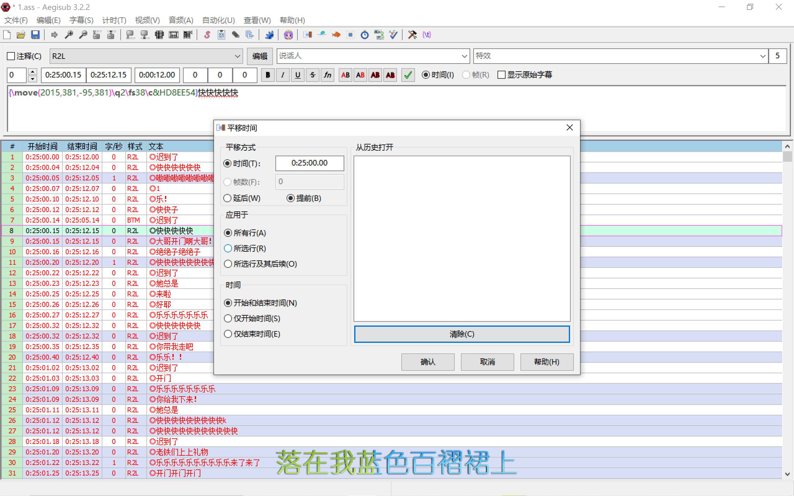

保存退出，一段2分钟的视频和弹幕就拿到了
