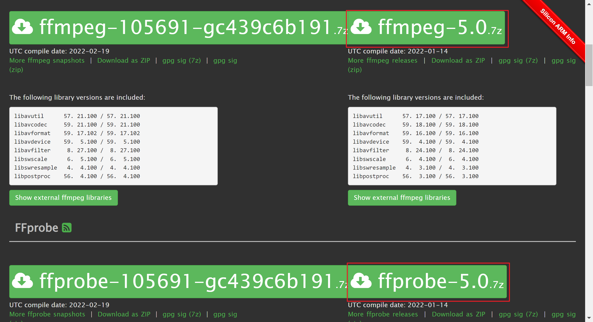

### 前言

本文介绍的方法为最适合小白的方法，由于我没有Mac系统，所以用Windows系统演示，与Mac系统步骤是一样的。~~提到的软件并没有能直接用于M1芯片的版本，需要源码编译安装，要有一定的计算机基础才能解决。~~我忘记还有rosetta2了，不需要自己编译了，我还找到了Aegisub和ffmpeg的m1版。

### 录播

[blrec](https://github.djj45.workers.dev/acgnhiki/blrec)是用python写的，可以直接用pip安装，考虑到可能会有依赖等问题，故采用docker安装。m1不能用blrec的docker版，用pip不知道能不能装上。如果不可以，多尝试几个项目

https://github.djj45.workers.dev/valkjsaaa/auto-bilibili-recorder

https://github.djj45.workers.dev/AsaChiri/DDRecorder

都不行的话，[可以用ffmpeg录抖音](./录播.md#抖音录播)，不过录不了b限和弹幕，视频码率低2k

- 安装docker

  https://hub.docker.com/editions/community/docker-ce-desktop-mac

  点击`Mac with Intel chip`下载

- 启动

  参照https://github.djj45.workers.dev/acgnhiki/blrec#docker中的默认参数，在命令行输入，第一次启动请耐心等待下载镜像，下载完成后在浏览器输入`localhost:2233`即可访问录播页面

  ```
  docker run -v ~/blrec:/rec -dp 2233:2233 acgnhiki/blrec
  ```

  简单说明一下docker的原理和这条命令的意思

  - docker是容器引擎，运行装在容器里面的程序，优点是可移植性强，把程序打包在一个容器里面，可以在不同CPU架构的电脑上运行，无需考虑不同电脑操作系统和依赖问题，系统能装docker，镜像支持该系统的CPU架构就可以运行
  - `~`是home目录，即`/Users/xxx`，`~/blrec`是home目录下的blrec文件夹，即`/Users/xxx/blrec`，录播保存的路径，可修改。冒号后面的`/rec`目录是容器内部的目录，不能修改。第一个2233为本机端口，启动容器后在浏览器输入`localhost:2233`即可访问录播页面，可修改。冒号后面的2233为容器内部端口，不可修改

### 录播分段下载

源码：https://github.djj45.workers.dev/A-Soul-Database/RangeDownloader/

- 安装python

  https://www.python.org/downloads/macos/

  找到`3.8.10 universal2`版，下载并安装

- 下载github源码

  https://githubdl.djj45.workers.dev/https://github.com/A-Soul-Database/RangeDownloader/archive/refs/heads/main.zip

- 解压并进入解压后的文件夹，[在这个目录下打开命令行窗口](https://zhuanlan.zhihu.com/p/162748665)

  

  输入命令安装依赖包

  ```
  pip install -i https://pypi.tuna.tsinghua.edu.cn/simple -r requirements.txt
  ```

  进入Code目录并启动

  ```
  cd Code
  python app.py
  ```

  然后会在浏览器弹出下载页面。以后只需在Code目录下打开命令行窗口，输入`python app.py`即可

### Aegisub

源码：https://github.djj45.workers.dev/Aegisub/Aegisub

M1版：https://gist.github.com/frozenpandaman/92a84cd2ba690bb2399afd04e695bf8c

M1版下载直链：https://elifessler.com/aegi/6a556aa-Aegisub.app.zip

**建议优先使用2018版**

测试版，2018年发布

http://plorkyeran.com/aegisub/

github版，2014年发布，版本过旧

https://githubdl.djj45.workers.dev/https://github.com/Aegisub/Aegisub/releases/download/v3.2.2/Aegisub-3.2.2.dmg

### 剪映字幕提取

https://gitee.com/djj45/jianyingsrt

### ffmpeg

源码：https://ffmpeg.org/download.html#get-sources

#### 下载

官网版：https://evermeet.cx/ffmpeg/

第三方版，支持m1：https://www.osxexperts.net/

ffmpeg是加字幕用的。ffprobe是分析视频信息用的，非必要。由于这两个网站下载速度可能很慢，我已经下载好了这两个压缩包，点击链接即可下载。mac解压7z格式需要额外的软件，嫌麻烦的可以下载解压后的文件。

https://od.djj45.workers.dev/%E8%BD%AF%E4%BB%B6/ffmpeg_mac/



#### 配置环境变量

参照https://zhuanlan.zhihu.com/p/341495283

解压刚才下载的ffmpeg和ffprobe压缩包，得到ffmpeg和ffprobe文件，把文件移动到`/usr/local/`目录里面，参照知乎里面的方法，把命令换成下面的

```
export ffmpeg=/usr/local/ffmpeg
export PATH=$PATH:$ffmpeg

export ffprobe=/usr/local/ffprobe
export PATH=$PATH:$ffprobe
```

