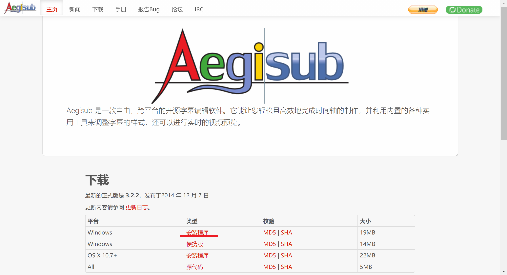
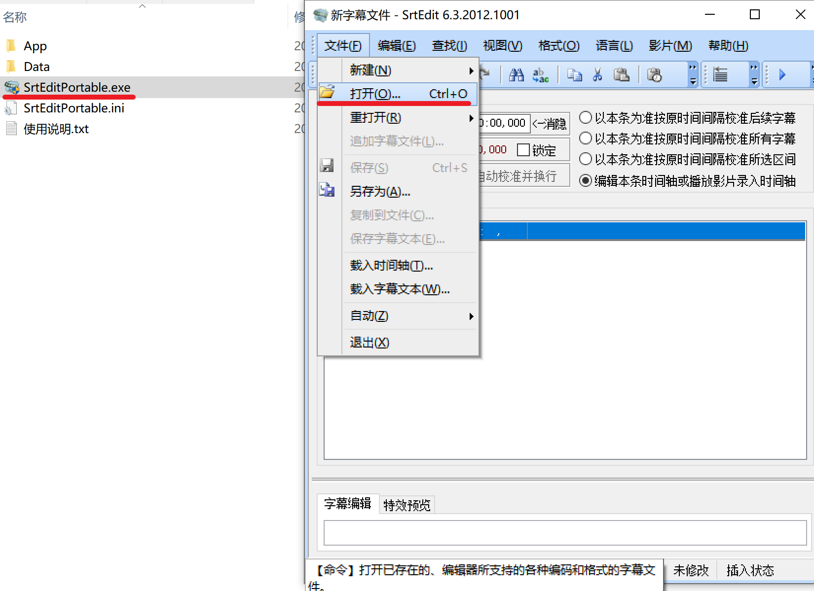
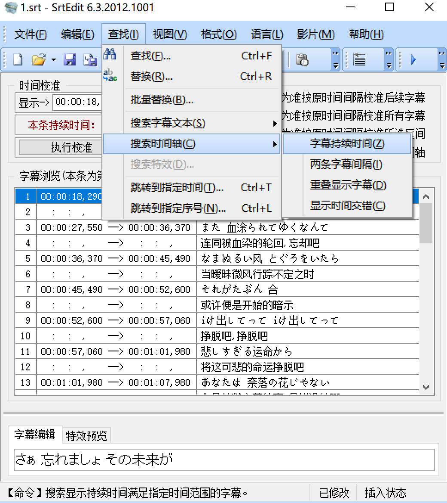
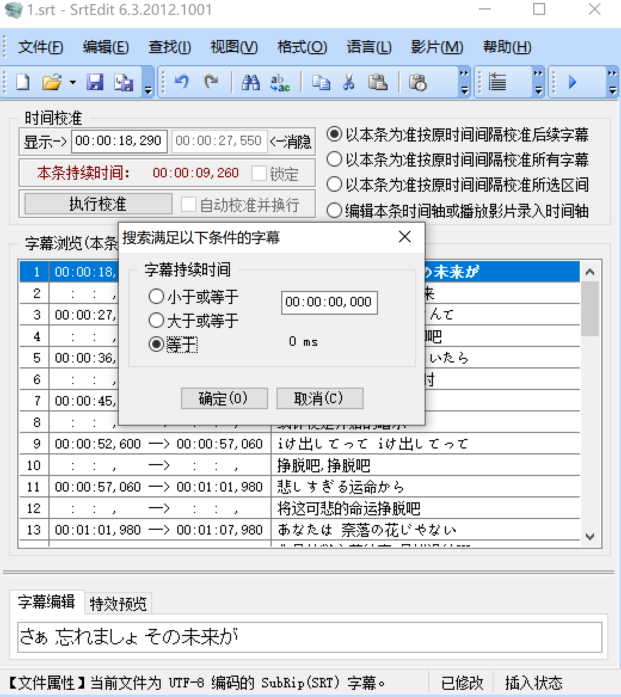
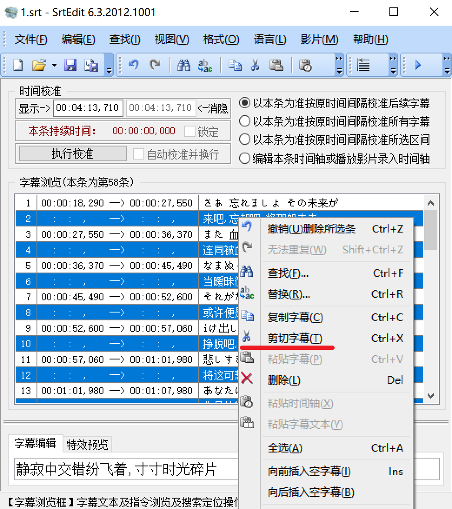
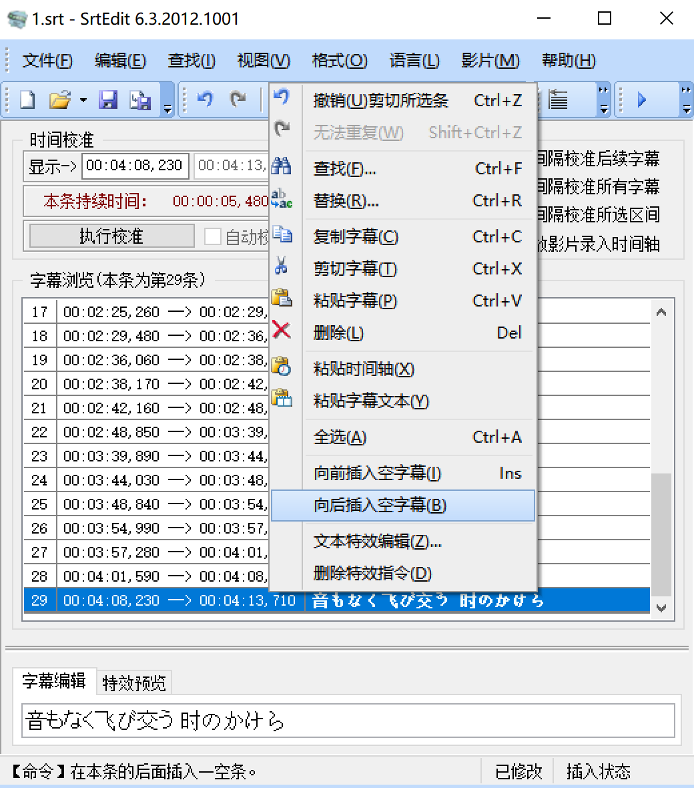
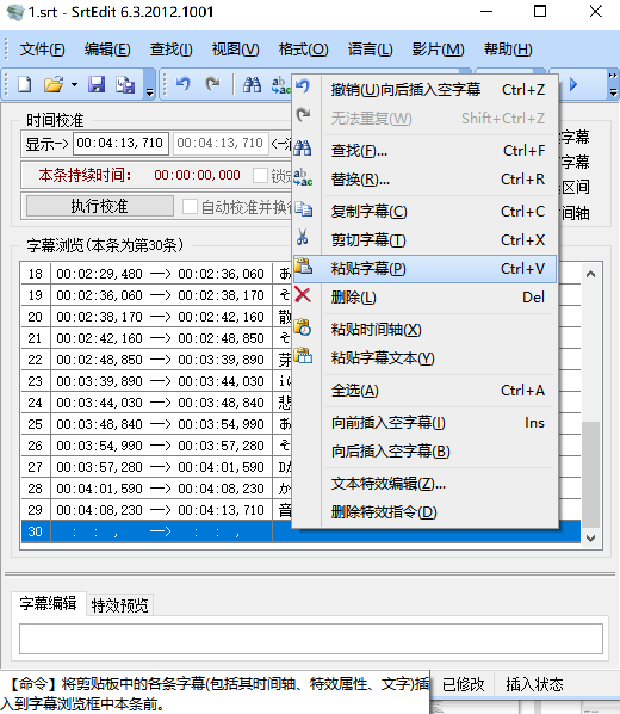
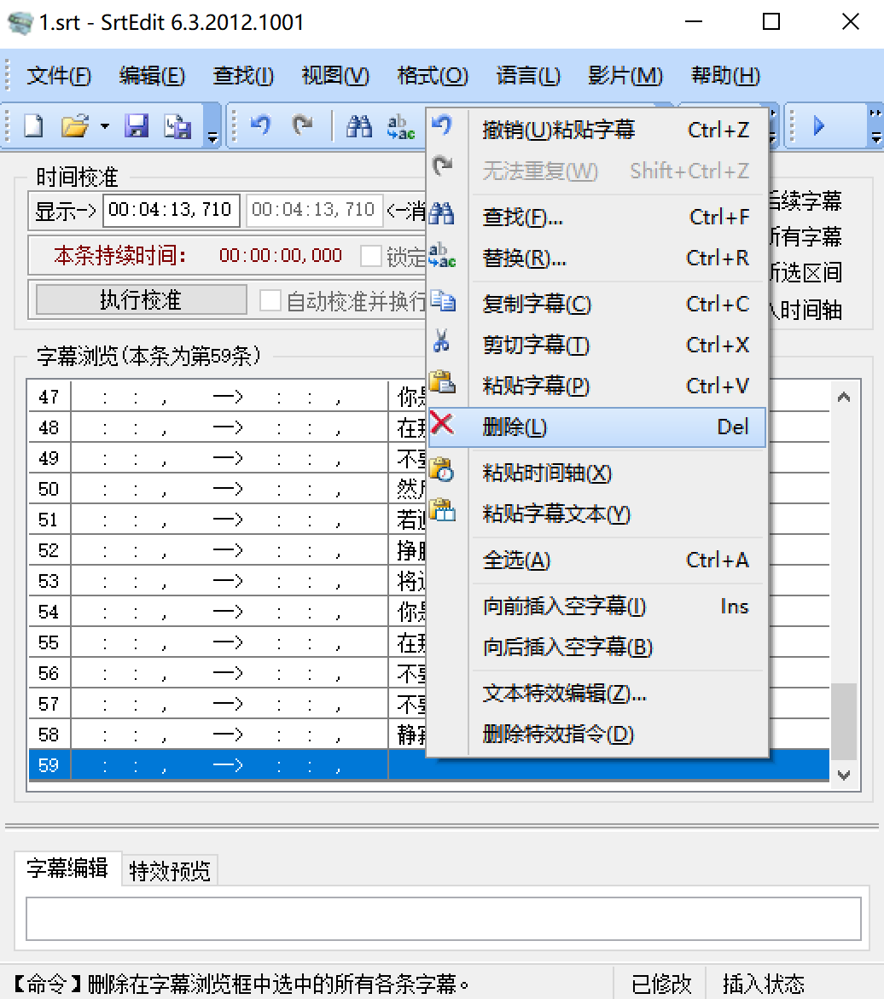
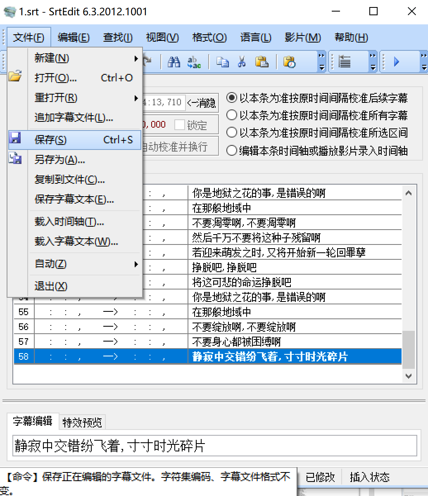

- [下载](#下载)
- [配置](#配置)
- [工作界面和快捷键](#工作界面和快捷键)
- [导入歌词](#导入歌词)
- [导入视频](#导入视频)
- [设置字幕样式](#设置字幕样式)
- [歌词字幕](#歌词字幕)
  - [LRC歌词](#LRC歌词)
  - [淡入淡出](#淡入淡出)
  - [文本歌词手动打轴](#文本歌词手动打轴)
  - [双语字幕](#双语字幕)
    - [中日歌词分离](#中日歌词分离)
      - [方法一](#方法一)
      - [方法二](#方法二)
    - [平移时间](#平移时间)
    - [复制时间轴](#复制时间轴)
    - [调换顺序](#调换顺序)
    - [加简单特效](#加简单特效)
- [自动打轴](#自动打轴)

### 下载

[Aegisub官网下载](https://aegi.vmoe.info/)

### 配置

点击选项

点击备份，设置一下自动保存的路径，保存间隔设为60秒，降低软件崩溃后的损失

### 工作界面和快捷键

黄色框是打轴的区域，用鼠标左键设置起始位置，用鼠标右键设置结束位置，鼠标滚轮控制音轨移动。红色箭头指的红线是起始位置，蓝色箭头指的蓝线是结束位置，红色线与蓝色线围成的时间就是一行字幕的显示时间。按快捷键`s`从起始位置播放到结束位置，按快捷键`t`从起始位置播放到歌曲结尾，播放过程中按快捷键`h` 停止，进度条回到开始位置。快捷键`q`是播放开始位置前0.5秒的声音，快捷键`w`是播放结束位置后0.5秒的声音，快捷键`d`是播放结束位置前0.5秒的声音，快捷键`g`确定红线到蓝线的范围为一句歌词，自动跳到下一句歌词。绿色箭头指的地方是选择字幕样式预设的地方，字幕样式需要自定义。右边橙色框从左到右三个滑块调节分别的是水平缩放（调一下就懂了），频谱的高度和音量的大小，点击紫色箭头可以解除频谱高度与音量大小的同步，为了打轴方便，解除同步并把频谱高度调到最大，调节合适的音量。下面粉色框的位置是歌词手动输入和添加效果的地方。如果光标在粉色框时想用快捷键或者用不了快捷键的时候，鼠标左键单击最上方棕色箭头指的地方即可

### 导入歌词

歌词的下载方法参考[杂篇](./杂篇.md#找歌词)

Aegisub不支持直接导入LRC格式歌词，需要转换成SRT格式，[在线转换](http://www.lrccon.com/convert.php)

上面的网站转换日文歌词会出现乱码，需要下载[转换软件](http://www.xitongzhijia.net/soft/152316.html)

### 导入视频

Aegisub不支持直接导入flv格式，需要[转封装](./ffmpeg.md#转封装)为mp4

视频可以这样拖进去

也可以这样添加

先导入字幕再导入视频

### 设置字幕样式

点击样式管理器

点击新建

字体选用Source Han Sans（思源宋体，免费使用，系统自带的Source Han Sans显示有问题就下载思源宋体安装）开头的几种中的一种，不想要阴影改为0，次要颜色就是卡拉OK的时候没有唱过的字显示的颜色，想要字幕显示像卡拉OK一样需要k帧，k帧就不展开了，普通歌词次要颜色不显示。对齐方式选左下角（1），下面（2）或者右下角（3）。先点击确定，边距和字体等一下一边预览一边调节

如果电脑的显示缩放不是100%，Aegisub的取色器就会出现问题，取色的区域是取色器上方的区域而不是取色器触碰到的那个点，十六进制颜色写在红框处

主要颜色可以用应援色

点击复制到当前脚本

任意单击一行字幕，Ctrl+A全选，全部换成刚刚设置的样式

把画面调大，播放，看一下字幕样式是否满意。

预览不满意的话打开样式管理器，单击想要修改的样式，点编辑

调样式的时候按应用就可以预览了，最后满意了就按确定

把调好的样式复制到样式库保存，下次就可以直接使用了

### 歌词字幕

#### LRC歌词

如果导入的是带时间轴的LRC歌词，批量修改时间轴就可以了，不需要手动打轴

鼠标点击第一行字幕，然后点击一下红色箭头所指的地方，用快捷键就不会出错，按`t`键开始播放，记录第一句唱的时间，按`h`键停止播放

鼠标移动到箭头指的地方，开始时间是0:00:23.90，歌词的开始时间是0:00:16.40，所以歌词要延后0:00:07.50

点击平移时间

输入时间，延后，应用于所有行的开始和结束时间，确定

#### 淡入淡出

单击第一行字幕，右键，在第一行之前插入一行

勾选注释，在右边红框处输入template，在下面红框处输入淡入淡出代码`{\fad(200,200)}`，代码用英文键盘输入，左边是淡入时间，右边是淡出时间

选中特效字幕，点击自动化，应用卡拉OK模板

放大预览

如果不满意，改变特效代码，重新应用一次卡拉OK模板即可

点击另存为字幕，与视频放在同一个目录下

#### 文本歌词手动打轴

新建一个txt文档，把歌词粘贴进去，空白行不用管，一行一句歌词

导入字幕，点击确定

然后再导入视频，用`s`，`q`，`w`，`d`，`g`，鼠标左右键，鼠标滚轮配合，一句的结尾紧贴下一句的开头（间隔过长除外，如间奏），紧贴的话按`g`键跳到下一句，开头部分就对好了，只需考虑结尾即可

加个简单的[淡入淡出](#淡入淡出)特效就可以导出了

#### 双语字幕

下面介绍中日双语字幕的处理方法，中英双语字幕同理

日语的LRC双语字幕需要软件来转换成SRT字幕，在线转换有乱码，[转换软件下载](http://www.xitongzhijia.net/soft/152316.html)

中英双语字幕也可以用上面的转换软件，[网站转换](http://www.lrccon.com/convert.php)更方便

导入转换好的SRT字幕发现日文与中文是交错的，而且日文字幕的开始时间和结束时间是正常的，中文字幕的开始时间和结束时间是一样的，中文字幕显示不了（情况可能相反）

##### 中日歌词分离

###### 方法一

在[b站专栏](https://www.bilibili.com/read/cv6740177/)找到的一个非常好用的[Aegisub插件](https://github.com/dumpling233/aegisub_Automation)

点击绿色的code按钮，鼠标移动到Download Zip上，右键，复制链接，粘贴到[GitHub加速下载](http://shrill-pond-3e81.hunsh.workers.dev/)网站下载

把歌词处理小插件粘贴到Aegisub的安装目录下的这个文件夹里面

把歌词导入进Aegisub，歌词一定要中日交替，这里第一行不是歌词，不符合中日交替，点击第一行，右键，把第一行删掉

点击任意一行歌词，Ctrl+A全选，点击自动化，歌词处理，中日分离即可

###### 方法二

有更加简单的方法一，没必要用方法二了

[SRT编辑软件下载](http://www.xitongzhijia.net/soft/92161.html)

打开字幕

点击查找，搜索时间轴，搜索字幕持续时间

搜索持续时间等于0ms的字幕

中文字幕全部选中，鼠标放在任意一行选中的字幕上，右键，剪切字幕

点击最后一行日文字幕，单击向后插入空字幕

点击新建的空字幕，右键，粘贴字幕

拉到最后点击空字幕，右键，删除

点击文件，保存即可

##### 平移时间

先把修改后的字幕导入Aegisub，再导入视频，点击第一行字幕，按`t`键，记录第一句开始的时间，这里是0:00:25.65，然后[平移时间](#LRC歌词)

##### 复制时间轴

选择全部的日文字幕（鼠标单击第一行日文字幕，拉到最后一行日文字幕，先按`Shift` 键再单击最后一行日文字幕），右键，复制行

选择所有的中文字幕，右键，选择性粘贴

勾选开始时间和结束时间，确定即可

##### 调换顺序

如果下面的字幕日语在上面，中文在下面，实际显示的时候日文在下面，中文在上面，如果想调换顺序，把所有中文字幕[剪切粘贴](#双语字幕)到日文字幕上面即可

##### 加简单特效

[添加淡入淡出](#淡入淡出)

### 自动打轴

[dd烤肉机官方教程](https://www.bilibili.com/video/BV1p5411b7o7)

功能有AI自动打轴，人声与背景声分离，扩4k分辨率等，下载的时候用[GitHub加速下载](http://shrill-pond-3e81.hunsh.workers.dev/)，我本来想试一试的，不过要装k-lite解码器（包含了LAV分离解码器等），我电脑单独下载的LAV配PotPlayer，再装k-lite会冲突，可能要重新配置一次PotPlayer，很麻烦，所以没有试

dd烤肉机主要是给日V字幕组翻译用的，AI打出来的轴不如人工打轴准确，背景音乐人声比较清晰会影响打轴的准确性，打出来的轴可能要手动去调整，官方视频里面没有给出很多人一起说话时AI打轴的效果，不知道能不能识别不同人的声音
