- [b站录播](#b站录播)
  - [下载录播姬](#下载录播姬)
  - [配置录播姬](#配置录播姬)
  - [开始录播](#开始录播)
  - [光速切片](#光速切片)
  - [合并](#合并)
    - [弹幕](#弹幕)
    - [视频](#视频)
  - [看录播](#看录播)
- [抖音录播](#抖音录播)
  - [直播源抓取](#直播源抓取)
    - [方法一](#方法一)
    - [方法二](#方法二)
  - [PotPlayer录播(参考豆瓣帖子)](#PotPlayer录播(参考豆瓣帖子))
  - [ffmpeg录播](#ffmpeg录播)
  - [ffmpeg自动录播工具](#ffmpeg自动录播工具)
  - [弹幕](#弹幕)
- [xml弹幕转ass弹幕](#xml弹幕转ass弹幕)

## b站录播

### 下载录播姬

[录播姬官网](https://rec.danmuji.org/)

[录播姬官方使用文档](https://rec.danmuji.org/docs/)

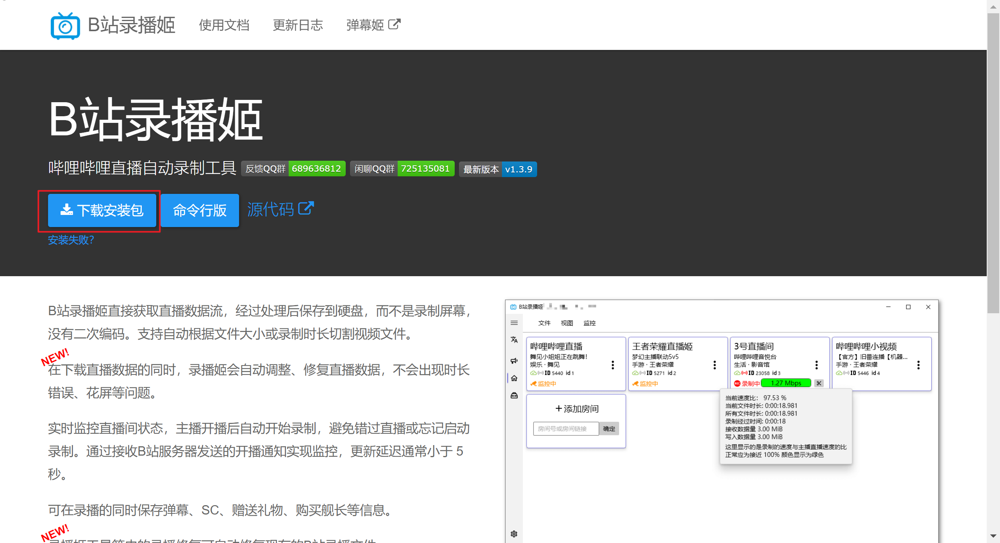

### 配置录播姬

打开后出现这个界面，选择一个==空文件夹==作为工作目录。如果不想每次打开都弹窗询问工作目录且工作目录固定，勾选不再询问

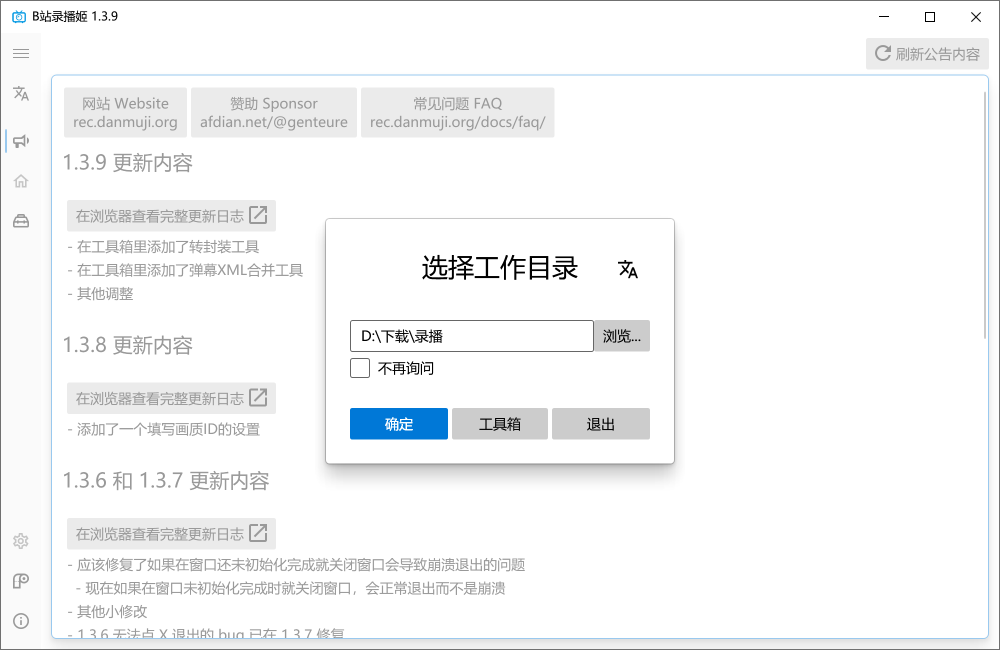

点击左侧的小齿轮图标进入设置

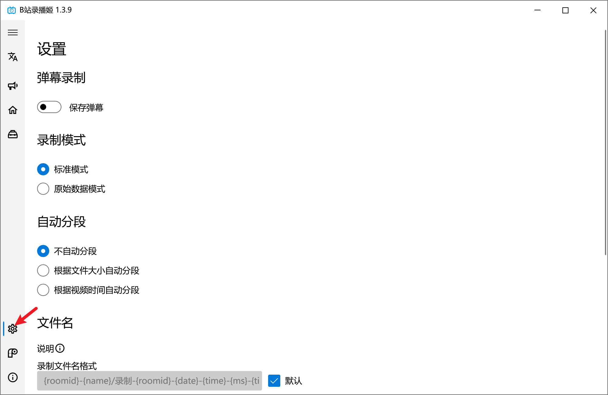

如果没有特殊需求，勾选保存弹幕即可，其他选项的具体含义参考[录播姬官方使用文档](https://rec.danmuji.org/docs/)

录播姬可以保存SC、舰长、礼物信息，[转换](#xml弹幕转ass弹幕)后可以播放这些信息

自动分段没有必要设置，分段越多[合并](./ffmpeg.md#拼接视频)的时候越容易出现问题。在直播唱完一首歌或者跳完一段舞蹈后可以[光速切片](#光速切片)

如果觉得原画画面太亮，不勾选默认，手动设置画质，画质ID对应的画质为

> 20000-4K，10000-原画，401-蓝光(杜比) ，400-蓝光，150-高清，80-流畅


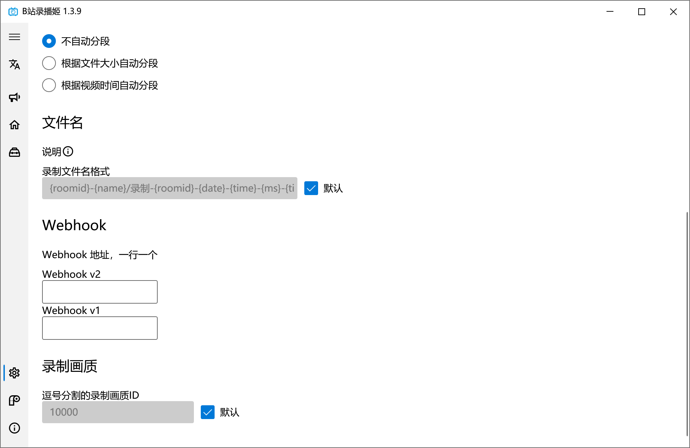

### 开始录播

点击左侧的小房子来到录播界面，复制电脑端直播间网址的链接`https://live.bilibili.com/22637261`或者房间号`22637261`，粘贴，点击确定添加房间

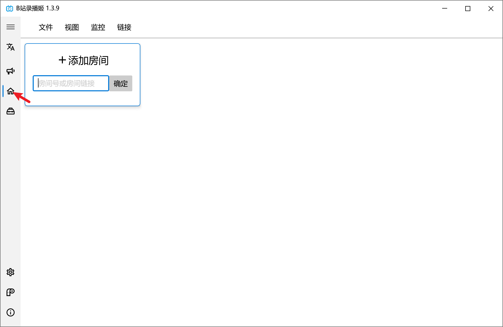

如果添加的房间正在直播，会自动录制，如果没有开播，刚开播的时候会自动录制，点击三个点弹出录播录制设置。可以设置是否自动录制（刚开始推流就自动录制，下播停止录制），手动开始录播，停止录播也是在这里操作的

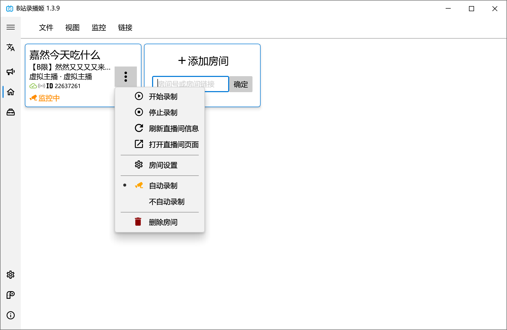

### 光速切片

在录制的过程中点击小剪刀剪断录播（还在继续录制，手动分段，可以[合并](./ffmpeg.md#拼接视频)）。在歌舞的开头和结尾各点一下，就把一段歌舞切出来了

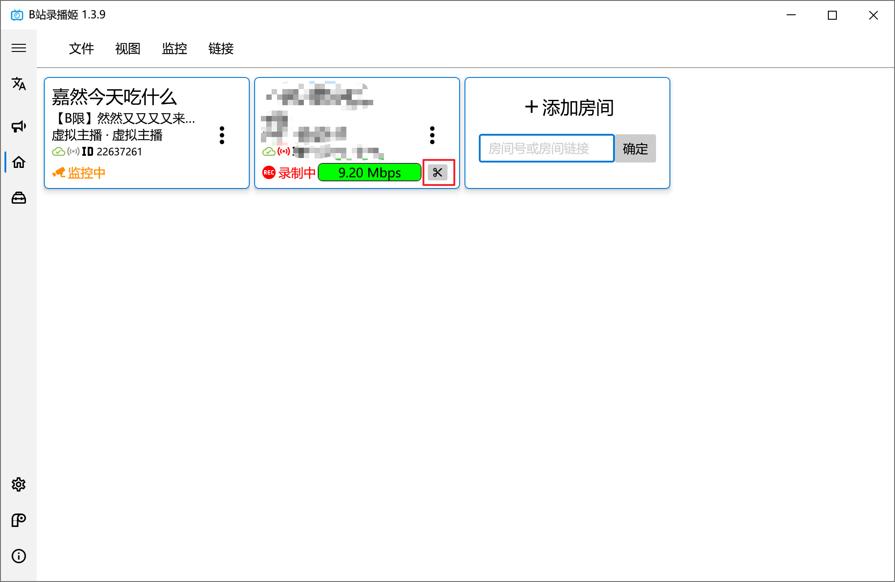

### 合并

#### 弹幕

点击左侧的工具箱，选择弹幕合并。把同一场直播需要合并的弹幕全部添加，点击合并，起个合并后弹幕文件的名字即可

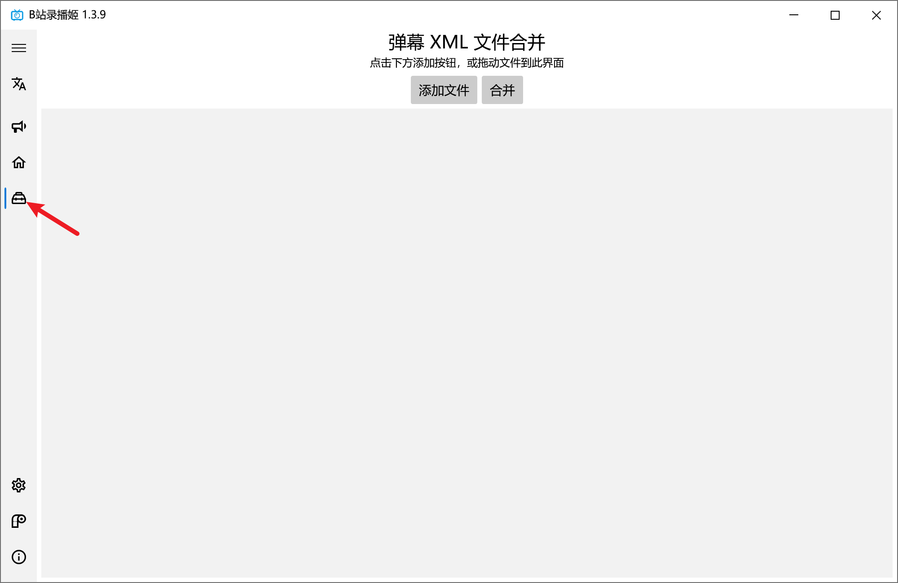

#### 视频

[ffmpeg合并](./ffmpeg.md#拼接视频)

### 看录播

将录播视频与弹幕改为同名，放在同一个文件夹里面

[下载弹弹play](http://www.dandanplay.com/)，不用弹弹play也可以，PotPlayer等播放器也可以播放，不过需要把[xml弹幕转换为ass弹幕](#xml弹幕转ass弹幕)

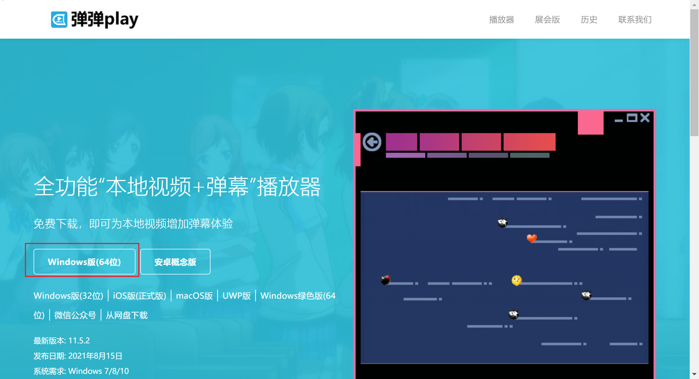

下载对应的版本，电脑一般是64位的

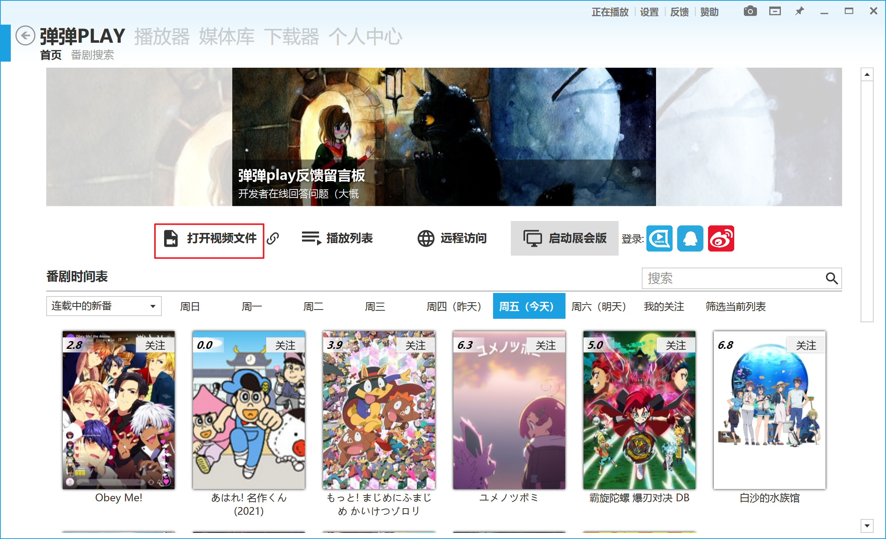

点击打开视频文件，选择录播视频。如果询问是否关联弹幕文件，选择不关联，把视频和弹幕改为同名的步骤就是关联了。用弹弹play配合弹幕文件看录播与看直播的效果是完全一样的

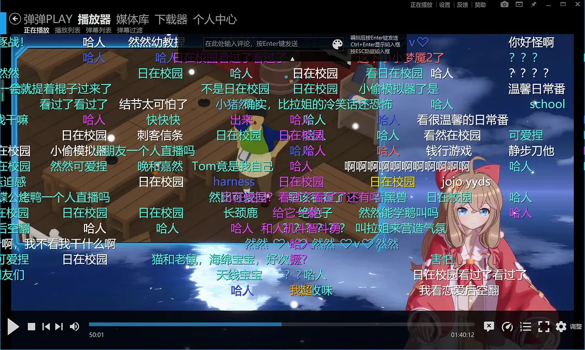

### 自动化

我不是计科的，有能力的au可以尝试一下录播，压制弹幕，投稿和上传云盘自动化

[录播姬Webhook说明](https://rec.danmuji.org/docs/basic/webhook/)

[b站自动化脚本](https://www.bilibili.com/read/cv10512059/)

[一位au做了b站录播自动上传百度网盘](https://space.bilibili.com/5273959)

## 抖音录播

#### 直播源抓取

两个方法，输入抖音直播间的分享链接（分享链接是不变的，开播才能分享）即可，房间id不知道是什么。抖音原画是 8M码率60帧

##### 方法一

豆u制作的[抓取网址](https://d.koishi.cc/)，[豆瓣原贴](https://www.douban.com/group/topic/242570971/)

##### 方法二

https://github.com/wbt5/real-url/blob/master/douyin.py

方法二抓到的m3u8源不是原画，需要[简单处理](https://d.koishi.cc/)，flv源是原画

方法一跟方法二的抓取代码是一样的，抓取得到flv源和m3u8源，强烈建议用==flv源==，flv源默认原画，录下来就是flv格式，方便

#### PotPlayer录播([参考豆瓣帖子](https://www.douban.com/group/topic/242535720/))

打开PotPlayer，右键，打开，打开链接或者直接用Ctrl+U快捷键

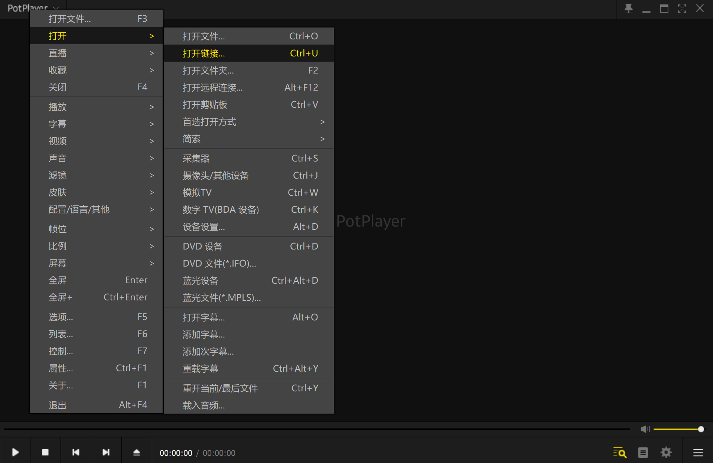

复制粘贴直播源，确定

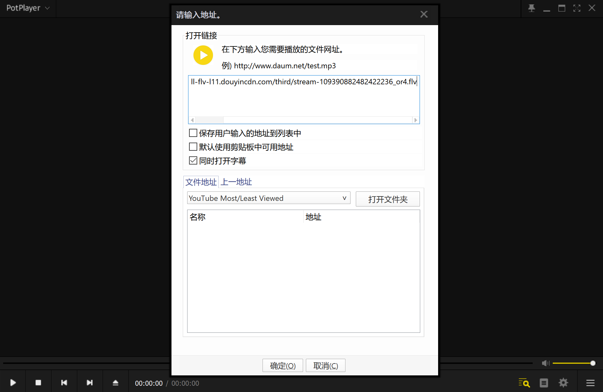

右键，视频，视频录制，保存流

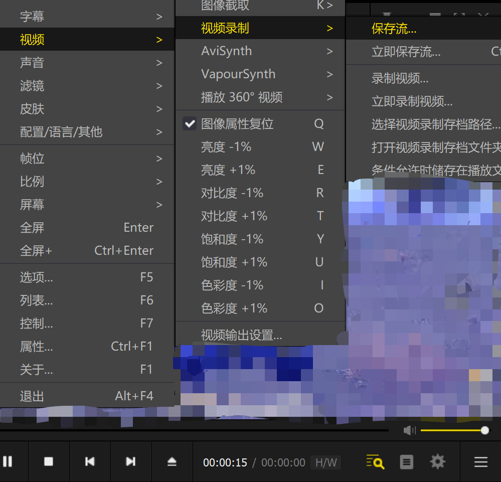

选择保存的位置，选择按时间中止，时间调高点，避免自动中断录制，按开始即可。

录制的过程中可以点击全屏，保存流的界面自动隐藏，但是录制还在继续，可以边看边录，结束的时候用同样的方法打开保存流的界面，点击停止即可。

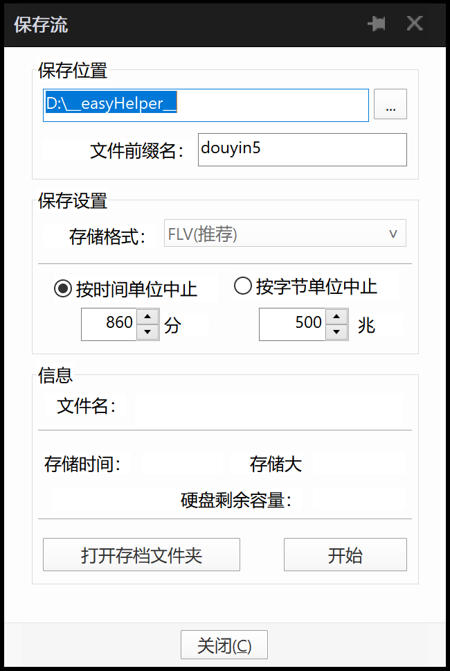

#### ffmpeg录播

代码如下，[具体操作](./ffmpeg.md)

```
ffmpeg -i url -c copy 1.flv
```

用flv源代替url，ffmpeg录制m3u8有点问题

#### ffmpeg自动录播工具

https://www.52pojie.cn/thread-1439751-1-1.html

可以像弹幕姬一样一开播就录播，操作简单

#### 弹幕

抖音是分弹幕池的，不同的人看到的弹幕不一样。抖音的弹幕接口暂时没有，无法进行弹幕录制

## xml弹幕转ass弹幕

[弹幕转换及弹幕调整工具](https://github.com/hihkm/DanmakuFactory#windows)

下载最新的GUI版

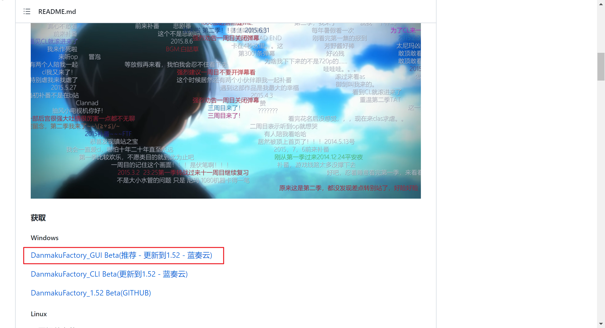

如果只是简单地转换，点击打开文件，选择需要转换的xml文件，点击转换即可。如果想调整一下弹幕，比如弹幕的显示范围，弹幕密度，字体等点击设置

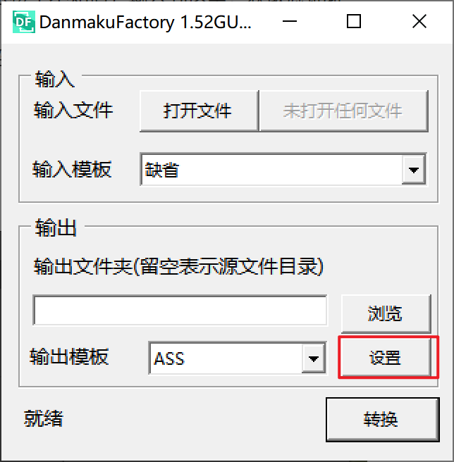

转换之后确认视频与ass弹幕文件同名，用PotPlayer等播放器打开就能自动识别。如果没有弹幕，右键，字幕，确认一下显示字幕的选项是否已经勾选上。

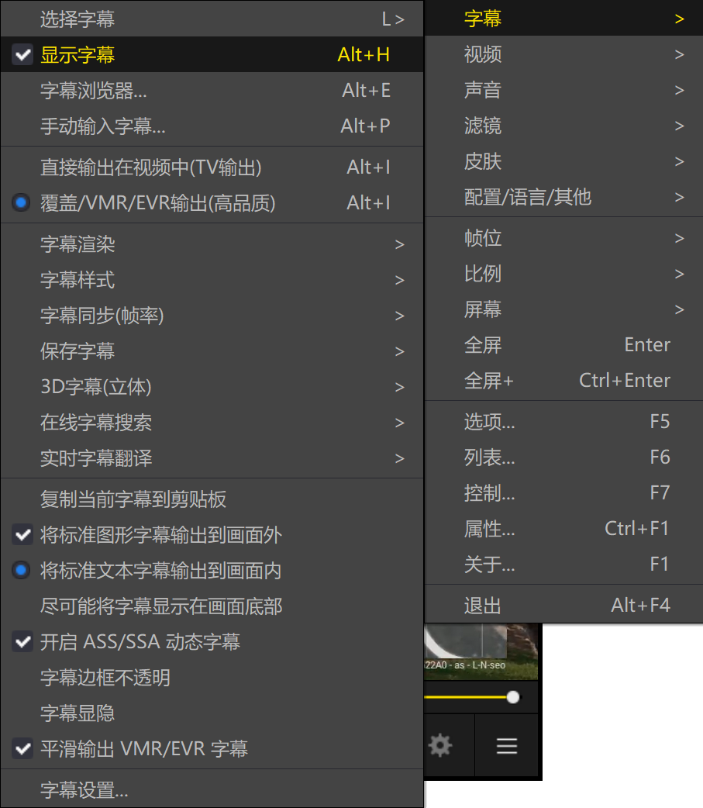

如果还是不行，右键，字幕，字幕设置，参考一下下图的设置。

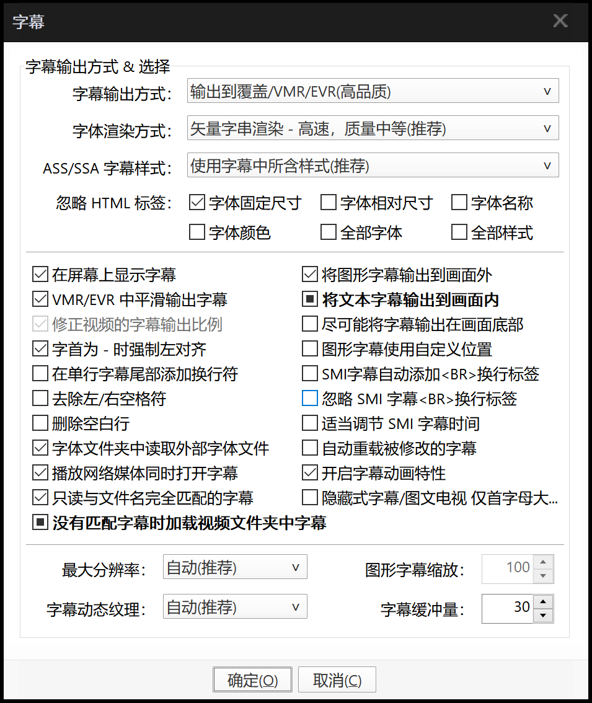
