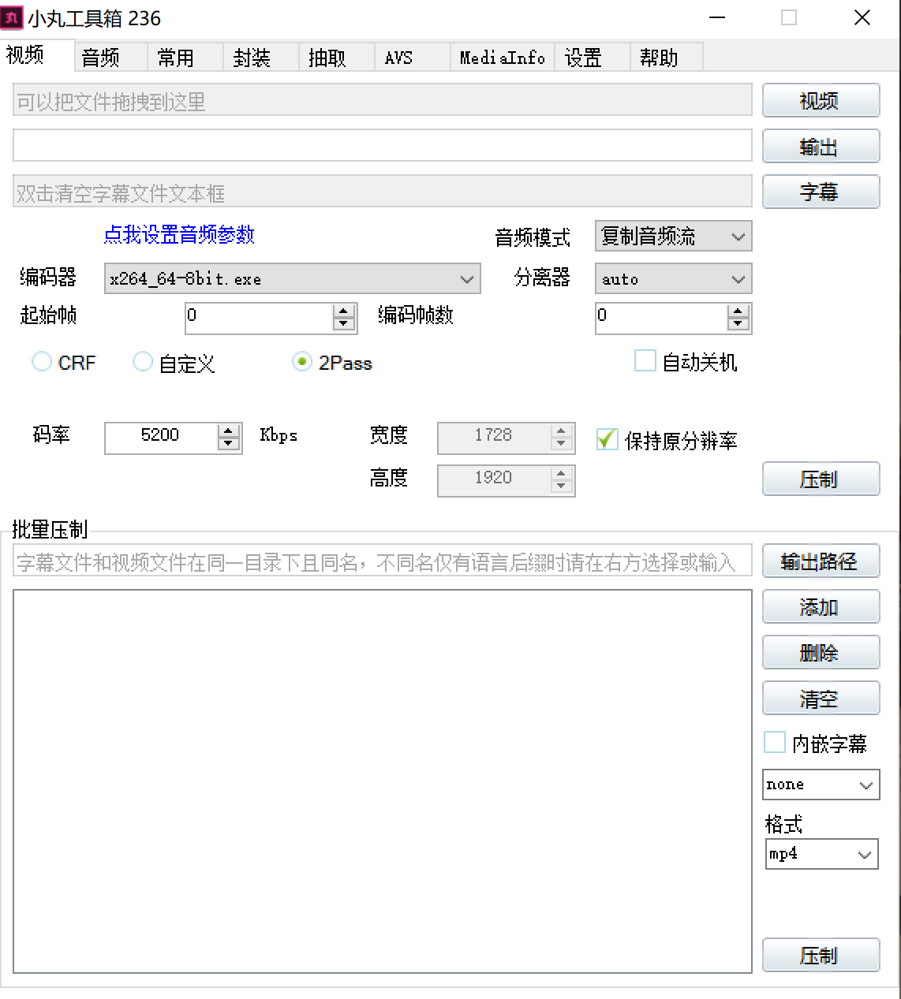
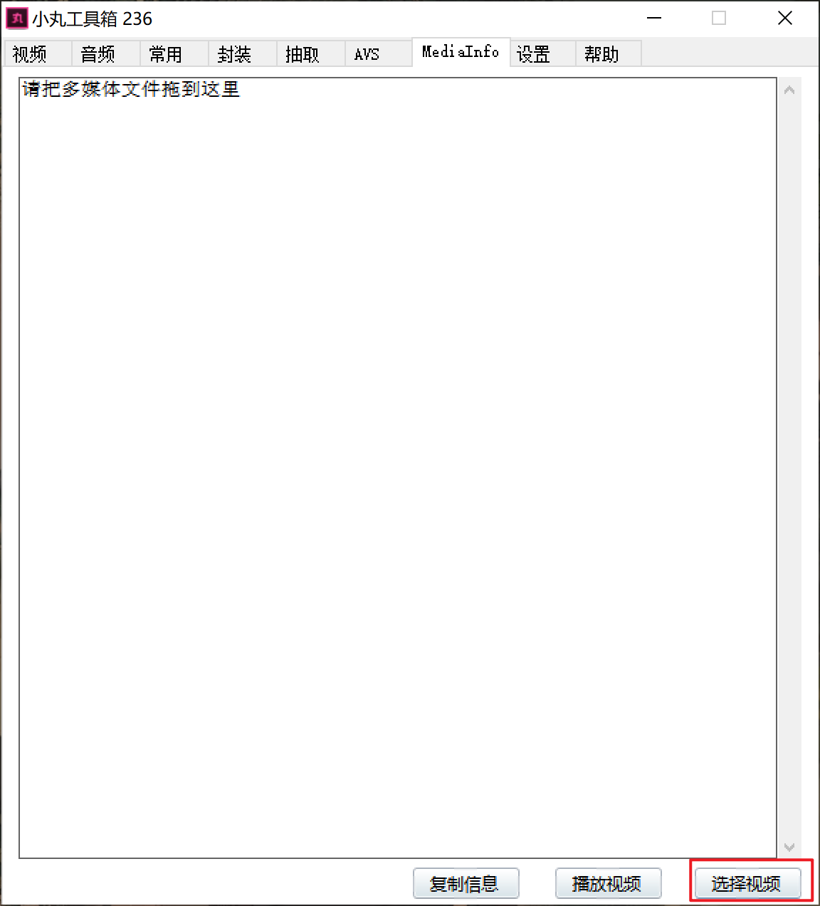
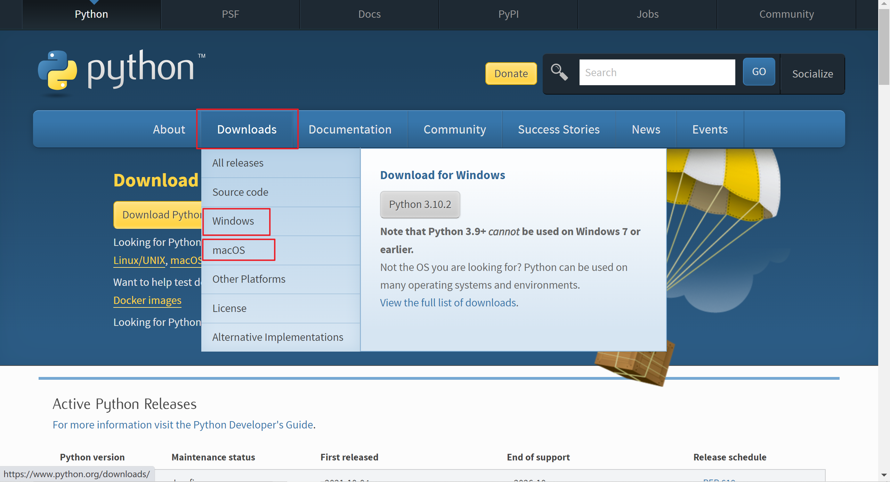

- [PotPlayer配置](#PotPlayer配置)
- [小丸工具箱](#小丸工具箱)
- [HandBrake](#HandBrake)
- [dd烤肉机](#dd烤肉机)
- [ae&pr教程](#ae&pr教程)
- [图片超分辨率](#图片超分辨率)
- [python](#python)

#### PotPlayer配置

如果使用PotPlayer播放器，想获得更好的观看体验，需要手动配置分离器，解码器，渲染器，配置方法参考百度贴吧的[帖子](https://tieba.baidu.com/p/7171344019)

#### 小丸工具箱

[官网下载](https://maruko.appinn.me/)，下载推荐的那个。官网链接已经炸了，这是我以前保存的

https://od.djj45.workers.dev/%E8%BD%AF%E4%BB%B6/

编码器选择如图所示，音频流选择复制，添加视频和字幕，点击压制就行，参数的设置与ffmpeg一样的，不同就是ffmpeg是一条横杆`-`，小丸工具箱是两条`--`，ffmpeg的`-c:v 5M`参数，小丸工具箱要写`--bitrate 5000`，小丸工具箱与ffmpeg使用的都是x264编码器，参数设置一样，压制的效果和时间都是一样的

小丸的2pass设置不了其他参数，只能填码率

把视频拖动到MediaInfo选项卡内或者点击选择视频，添加视频，查看视频的信息

#### HandBrake

图形化软件，支持中文，与ffmpeg的用法一样，支持Windows、Mac、Linux，[官网下载](https://handbrake.fr/downloads.php)

#### dd烤肉机

[dd烤肉机官方教程](https://www.bilibili.com/video/BV1p5411b7o7)

功能有AI自动打轴，人声与背景声分离，扩4k分辨率等，下载的时候用[GitHub加速下载](http://shrill-pond-3e81.hunsh.workers.dev/)，我本来想试一试的，不过要装k-lite解码器（包含了LAV分离解码器等），我电脑单独下载的LAV配PotPlayer，再装k-lite会冲突，可能要重新配置一次PotPlayer，很麻烦，所以没有试

dd烤肉机主要是给日V字幕组翻译用的，AI打出来的轴不如人工打轴准确，背景音乐人声比较清晰会影响打轴的准确性，打出来的轴可能要手动去调整，官方视频里面没有给出很多人一起说话时AI打轴的效果，不知道能不能识别不同人的声音

#### ae&pr教程

https://www.douban.com/group/topic/252380670/?_i=3698414RMhUFsw

#### 图片超分辨率

https://github.djj45.workers.dev/xinntao/Real-ESRGAN/blob/master/README_CN.md

#### python

https://www.python.org/downloads/

找到自己的系统，下载`3.8.10`或者`3.8.12`安装包，不要下载最新版，有些依赖模块可能没有适配

安装默认下一步就好，有个`add PATH`之类的选项，一定要勾上
