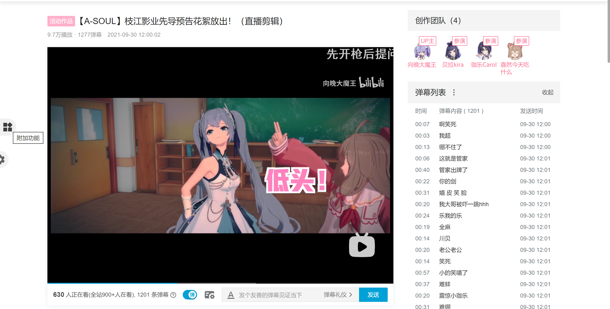
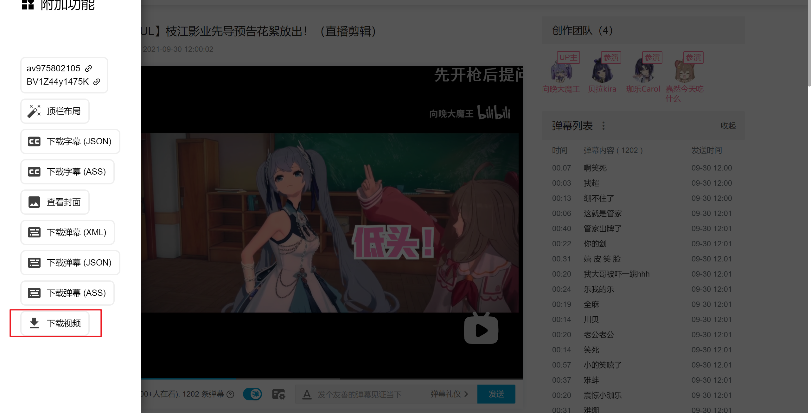
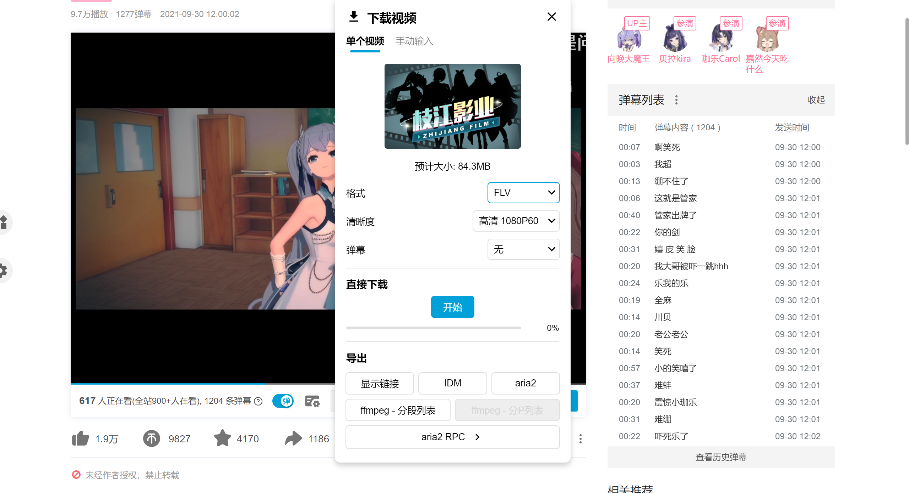
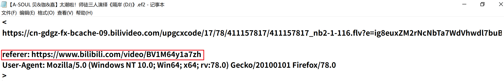
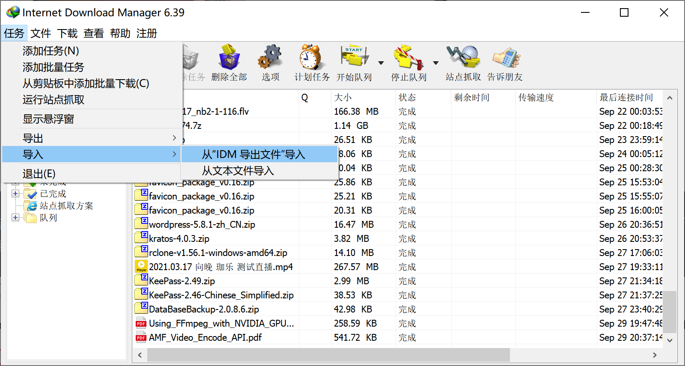

- [原画录播片段下载](#原画录播片段下载)
- [录播整段下载](#录播整段下载)
- [音乐](#音乐)
- [网站合集](#网站合集)

### 原画录播片段下载

[录播网站](https://asoul1.asoul-rec.com/)

[片段下载介绍](https://www.douban.com/group/topic/257973065/?_i=3699751RMhUFsw)

[片段下载](https://livedb.asoulfan.com/rangeDownload/index.html)

### 录播整段下载

b站的源码率直播回放没了，想要下载录播除了自己录还可以下载别人的录播

1. [网盘版源码率录播](https://www.bilibili.com/read/cv12928332)

2. 配合[b站油猴插件](https://github.com/the1812/Bilibili-Evolved)下载[录播man](https://www.douban.com/group/topic/241493350/)的有损录播

油猴是Tampermonkey，在浏览器的应用商店里面搜索Tampermonkey安装

谷歌浏览器的应用商店打不开的话就到[这里](https://www.cxyhub.com/all/development/45/)下载

b站油猴插件打不开或者下载慢的话就用下面的链接

https://hub.fastgit.org/the1812/Bilibili-Evolved

https://github.com.cnpmjs.org/the1812/Bilibili-Evolved

插件的用法就是b站网页版打开一个视频，点左边侧栏的第一个按钮，最后一个选项是下载视频

格式有FLV(h264)与DASH(可选h265与h264，下载后是mp4格式)可以选，h265的优点是体积小，不过A-SOUL的视频原本是h264，从h264转到h265，理论上会有一些轻微的画质损失

点击直接下载中的开始是用浏览器下载

点击导出中的显示链接，FLV是一条链接，DASH是音频与视频分开的，有两条链接，链接不能复制到IDM等下载工具下载（下文说明为什么不能用IDM等下载工具下载），只能用鼠标点击，通过浏览器下载

点击IDM，下载一个扩展名为ef2的文件，打开文件，可以看到除了下载链接与UA，还有一个referer参数，所以直接把下载链接复制粘贴到IDM等第三方下载工具是不行的，缺少referer参数是不能下载的

打开IDM，点击任务，导入，从“IDM导出文件”导入，选择刚才下载的ef2文件即可

点击aria2会下载一个txt文件，使用aria2c多线程命令行工具可以下载，具体方法不说了

ffmpeg分段列表我不知道有什么用

aria2 RPC是配合AriaNg使用的，先启动AriaNg，连接Aria2，再点击aria2 RPC就开始下载了，[AriaNg+Aria2懒人包下载](https://zhuanlan.zhihu.com/p/37021947)

### 音乐

https://music.163.com/#/user/home?id=61060637

https://music.163.com/#/user/home?id=315928904

https://music.163.com/#/user/home?id=1523034961

https://t.bilibili.com/569982356787753808

### 网站

网站合集：

https://asoul.cloud/

https://asoulworld.com/

录播导航站：

https://nf.asoul-rec.com/

录播站说明：

https://gitee.com/djj45/douban1/blob/master/1.md