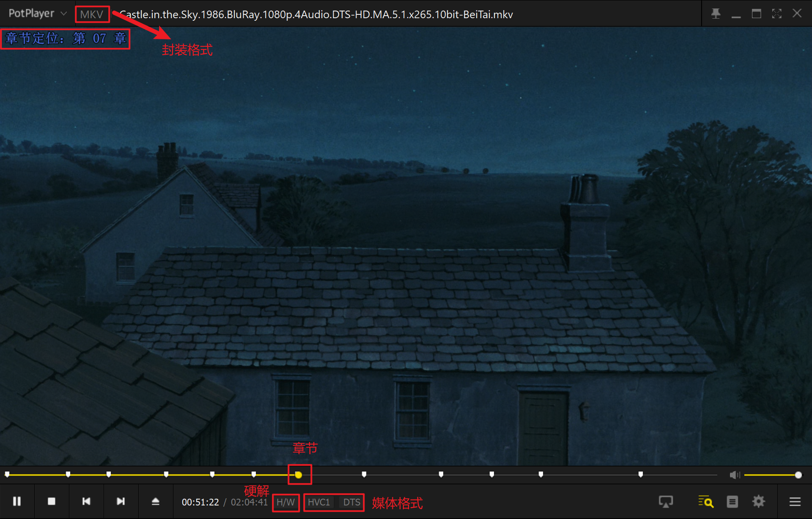
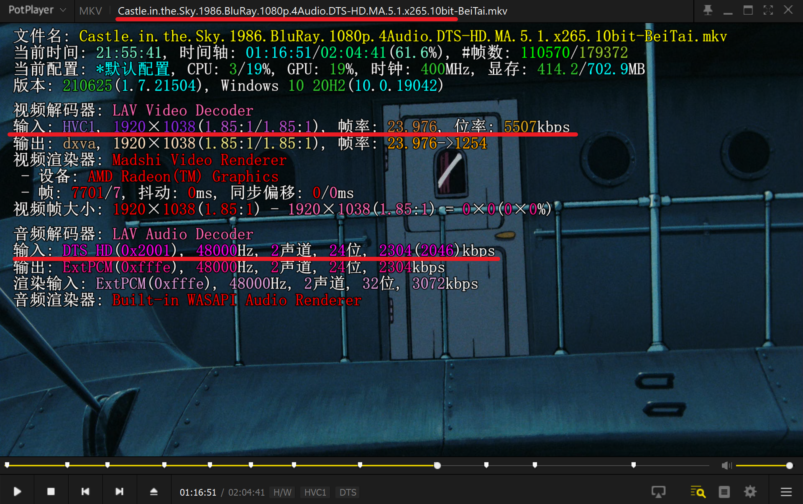
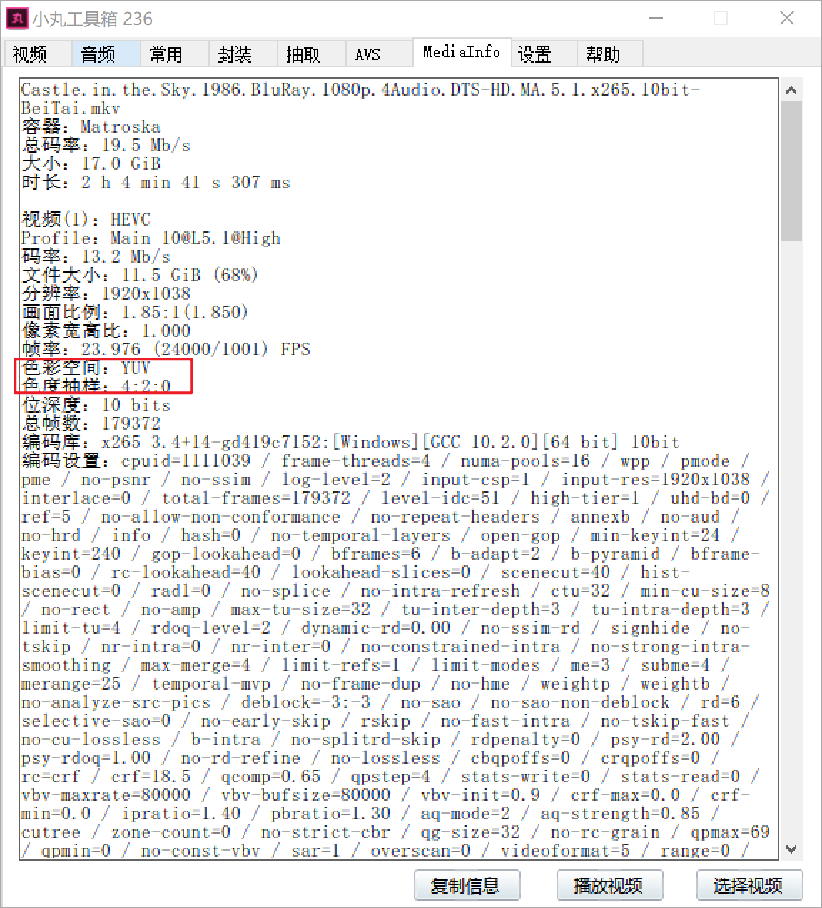
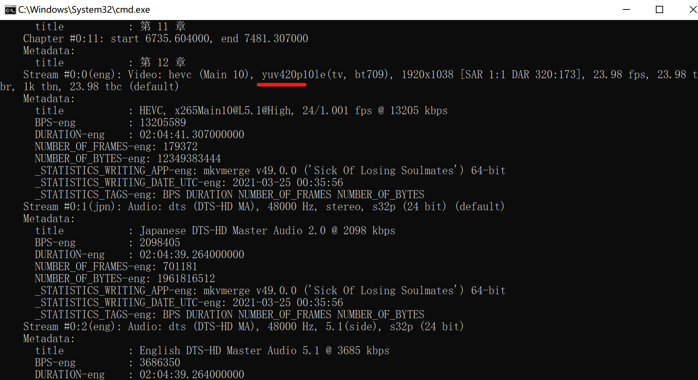
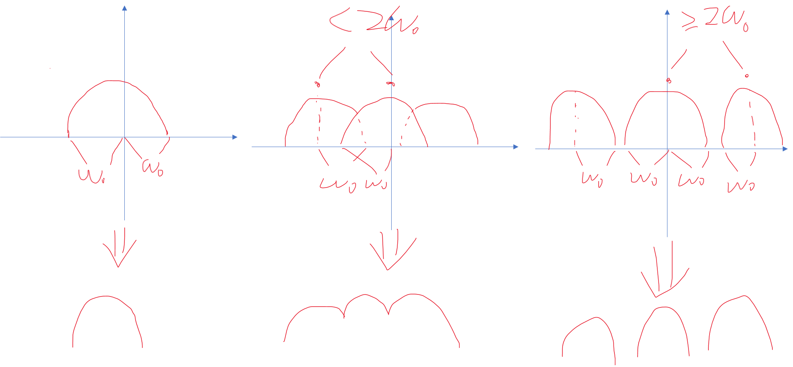

这篇文章的内容整理自字幕组的教程，维基百科，百度百科，CSDN，ffmpeg官方教程等

- [封装格式](#封装格式)
- [媒体格式](#媒体格式)
- [封装格式与媒体格式简单总结](#封装格式与媒体格式简单总结)
- [视频的组成](#视频的组成)
  - [分辨率](#分辨率)
  - [帧率](#帧率)
  - [隔行扫描与逐行扫描](#隔行扫描与逐行扫描)
  - [码率](#码率)
    - [码率的分配](#码率的分配)
  - [RGB模型与YUV模型](#RGB模型与YUV模型)
  - [色深](#色深)
  - [色度半采样](#色度半采样)
- [音频的组成](#音频的组成)
  - [采样率](#采样率)
  - [声道](#声道)
  - [位深度](#位深度)
  - [比特率](#比特率)
- [视频的播放](#视频的播放)
  - [分离](#分离)
  - [解码](#解码)
  - [渲染](#渲染)

### 封装格式

封装格式有MP4、MKV、FLV等。不同的封装格式类似用不同的包裹打包，包裹里面的东西叫轨道，轨道一般有视频，音频，章节和字幕。章节不常见，一般在电影的原盘里面有，见下图进度条上的标记。FLV和MP4都可以直接上传b站，录播是FLV格式，MP4与MKV相比，MKV支持封装FLAC作为音频，MP4则不支持。但是MP4也可以封装无损音轨ALAC，虽然普遍认为ALAC的效率不如FLAC优秀。另外，MKV支持封装ASS/SSA格式的字幕，MP4则不支持。一般字幕组制作的字幕是ASS格式， 所以内封字幕多见于MKV格式 。内封字幕也叫软字幕，不是压制进去的，是可以分离出来的。字幕还有硬字幕和外挂字幕，硬字幕是像水印一样嵌入视频里面的，无法提取出来，外挂字幕与视频是两个分开的文件，两个文件改为同名放在同一目录下，播放器可以自动识别，也可以在播放器中手动添加外挂字幕

在PotPlayer中，鼠标指针移动到进度条上两个章节之间，点击鼠标右键，会跳转到离鼠标指针最近的左边的章节上



### 媒体格式

视频的格式（不是封装格式，是视频本身的格式）常见的有H.264（也就是AVC或者AVC1）和H.265（HEVC），音频有无损的FLAC和ALAC，有损的AAC，MP3，DTS，Opus等，无损音频跟有损音频的一个区别是无损音频有[位深度](#位深度)，有损音频没有。上图中的HVC1（HEVC的一种，HEV1也是HEVC的一种）和DTS分别标明了视频和音频的格式。H/W是[硬件解码](#解码)的意思

### 封装格式与媒体格式简单总结

MP4，MKV，FLV相当于包裹，里面装着H.264或者H.265格式的视频，装着AAC，MP3等格式的音频，MKV还可以装FLAC格式的无损音频和ASS，SSA格式的字幕

### 视频的组成

#### 分辨率

大部分视频的宽：高=16：9，在这个比例下，720p视频的分辨率是1280\*720,1080p视频的分辨率是1920\*1080，1440p（2k）视频的分辨率是2560\*1440，2160p（4k）视频的分辨率是3840\*2160。1080p视频由横纵1920\*1080个像素组成，p指的是[逐行扫描](#[隔行扫描与逐行扫描])

#### 帧率

帧率就是每秒显示多少张图片，60帧就是每秒显示60张图片。由于人眼的视觉暂留效应，这些细微差别的图片不断变化，看起来好像画面在动一样。常见的标准帧率有24000/1001=23.976（在24000秒内显示1001张图片），大部分电影都是这个帧率，30000/1001=29.970，60000/1001=59.940等。我们常说的24帧，30帧，60帧通常指的就是四舍五入后的帧率，当然也有准确的24.000,30.000,60.000帧视频的存在。在动画制作中，一拍一指的是每秒24张图片，一拍二指的是每秒12张图片，一拍三指的是每秒8张图片，动画为了省钱常用一拍三。帧率可以是恒定的也可以是变化的，例如动画中的打斗场景，帧率比日常场景高

在PotPlayer中打开视频后，按键盘上的Tab键显示视频的信息，再按一次Tab键切换到显示视频简介，再按一次Tab键关闭视频简介。如果视频没有简介，第二次按Tab键就会关闭视频信息

原盘电影的名字包含了很多信息，如下图从左到右是影片名《天空之城》，在1986年正式上映，蓝光，分辨率高是1080个像素，[逐行扫描](#隔行扫描与逐行扫描)，影片里面有4种配音（4国配音，封装到MKV格式里面，可以切换），DTS-HD.MA.5.1是音频格式，x265是视频格式，10bit是[色深](#色深)

下面一条红线标出的是[视频的格式](#媒体格式)，[分辨率](#分辨率)，[帧率](#帧率)，[码率（PotPlayer显示的是一秒内的码率）](#码率)

再下面一条红线标出的是[音频的格式](#媒体格式)，[采样率](#采样率)，[声道](#声道)，[位深度](#位深度)，[比特率（PotPlayer显示的是一秒内的比特率）](#比特率)



#### 隔行扫描与逐行扫描

一个1080i的视频，`i`表示隔行扫描，如图。


> by en:user:Grayshi - [1]，CC BY-SA 3.0，https://commons.wikimedia.org/w/index.php?curid=2826758

老式的电视机用的就是隔行扫描，画面看起来有横着的抖动线条的感觉。隔行扫描先显示奇数行，再显示偶数行。以前技术不够，不能在比较短的时间内扫描整个屏幕。如果是从上到下逐行扫描的话，用的时间太长了，由于显示屏阴极射线荧光的衰减，从上往下扫描的时候，上半画面的亮度低，下半画面的亮度高，从下往上扫描时则相反，这样看起来画面会严重闪烁，所以当时采用隔行扫描，隔行先扫描一半，再扫描另一半。当时拍摄也是采用隔行扫描，假设一秒拍24幅图像，编号1到24，编号为奇数的图像记录的是拍摄的原始画面的一半和一半的黑条，编号为偶数的图像同理，也就是说，相邻的两张编号一奇一偶的图片，拼接成一幅完整的没有黑条可能有点歪的图片（不是来自同一帧，画面可能在运动）

隔行扫描有很多缺点。比如播放一个画面内物体运动的视频，由于奇数场与偶数场不是来自同一帧，运动的部分会产生锯齿状线条，需要用一项叫“去交错”的技术减轻这种线条。再比如奇数场中的一根细小的横线非常接近奇数场与偶数场的交界处且一部分在奇数场另一部分在偶数场，随着画面的刷新，细横线不断出现又不断消失，看起来在抖动，需要用“低通滤波器”技术减轻，但是画面会模糊

现代显示器的刷新率大幅度提高，最低的基本都是60Hz了，采用逐行扫描画面也不会出现闪烁，视频几乎全部是逐行扫描，观看体验更好

#### 码率

码率的定义是视频体积除以时间，基本单位是Kbps和Mbps。换算关系是8Kpbs=1KB/s,8Mbps=1MB/s，1000Kbps=1Mbps。一个8Mbps（8000Kbps）码率的两分钟视频（暂时忽略音频、字幕等）的大小是：8/8\*120=120MB

##### 码率的分配

码率的分配分为空间上的分配和时间上的分配

空间上的分配就是在一副画面中，细节越多，码率就要分配越多。比如拍摄，最高码率有限制，目标是清晰，拍摄背景是一面蓝色光滑的墙壁，地板上放着各种各样的东西，大部分码率肯定要分配给地板上的东西，小部分码率分配给墙壁，如果码率分配得当，画面整体看上去比较好，如果分配给墙壁的码率过高，地板上的东西就会模糊，反之亦然

时间上的分配就是帧与帧之间的复杂程度，比如拍摄，最高码率有限制，镜头不移动，背景静止，目标是清晰，拍摄一个站着不动的人需要的码率肯定比拍摄一个正在奔跑的人需要的码率低。但是因为人对运动的物体细节不太敏感，还没看清人就跑过去了，所以可以优先分配码率给静态背景。如果码率分配得当，动态静态看起来效果都好，如果大部分码率分配给动态，静态就会模糊，反之亦然

#### RGB模型与YUV模型

光的三原色RGB（红绿蓝）。如RGB24模型，表示R、G、B各用8位二进制数（整数0-255）表示颜色的强弱，组成各种各样的颜色

YUV模型也叫亮度-色度模型，与RGB模型之间通过[数学公式](#色深)转换。如最常见的YCbCr模型，用亮度通道（Y），蓝色色度（Cb），红色色度（Cr）表示，如下图，从上到下分别是原图，Y，Cb，Cr。






视频信息查看用的是[小丸工具箱](./杂篇.md#小丸工具箱)和[ffprobe](./ffmpeg.md#ffprobe的使用)

几乎所有视频用的都是YUV模型([YUV420](#色度半采样))，优点有

1. 人眼对亮度的敏感度高于色度，YUV模型绝大多数的信息位于Y通道，不像RGB模型是平均分配的，减少信息冗余量，便于压缩。假设一幅20\*20=400像素的彩色图片，RGB格式的，红绿蓝各400个数据，共1200个数据，转换为YUV格式，亮度400个数据，两个色度各100个数据，加起来600个数据，比原来缩减了一半
2. 对黑白显示设备兼容好
3. 调节亮度和颜色饱和度更方便

[所有的YUV格式](https://www.fourcc.org/yuv.php)

#### 色深

常见的有8bit和10bit。8bit是用8位二进制数（对应整数0-255）表示每个通道的值，10bit是用10位二进制数表示每个通道的值（对应整数0-1023）。一个8bit的显示器，播放8bit和10bit的影片是有区别的。显示器是RGB模型的，播放的时候显卡需要把YUV转换为RGB，这个过程叫[渲染](#渲染)。YUV转RGB的过程有小数的乘法运算，输入的精度越高，输出的精度同样越高

```c
    //RGB转YUV
    Y  = R *  0.29900 + G *  0.58700 + B *  0.11400
    Cb = R * -0.16874 + G * -0.33126 + B *  0.50000 + 128
    Cr = R *  0.50000 + G * -0.41869 + B * -0.08131 + 128
    //YUV转RGB
    R  = Y + (Cr - 128) *  1.40200
    G  = Y + (Cb - 128) * -0.34414 + (Cr - 128) * -0.71414
    B  = Y + (Cb - 128) *  1.77200
```

#### 色度半采样

YUV420的意思是Y保留全部，U和V记录的时候宽和高缩小二分之一，相当于每一个像素都采集一个Y值，四个相邻的像素（`田`）分别采集一个UV值。比如一个1080p的视频，亮度平面的分辨率是1920\*1080，两个色度平面的分辨率是960\*540。播放的时候先把UV平面的分辨率拉到和Y平面一样，再进行YUV转RGB，在显示器上输出图像

YUV420有YUV420p和YUV420sp两种。如果不加特别说明，YUV420指的就是YUV420p。YUV420,可分为I420，J420，YV12，YUV420sp可分为NV12和NV21，它们之间最根本的区别就是储存数据中Y，U，V的排列顺序和排列方式不同

### 音频的组成

#### 采样率

常见的采样率有44.1KHz（音乐）和48KHz（电影）等。人耳可以听到的频率是20-20000Hz，为什么采样率是人耳极限听力频率的两倍多呢？实际上，44.1KHz采样率记录的声音频率范围是0-22050Hz，48KHz采样率记录的声音频率范围是0-24KHz，因为奈奎斯特-香农采样定理，采样率要大于等于实际频率的两倍信号才不会失真

下图可以看到，当采样率小于原频率的两倍时，会发生混叠，波形改变了，声音失真。



#### 声道

声道是指声音在录制或播放时在不同空间位置采集或播放的相互独立的音频信号，所以声道数也就是声音录制时的音源数量或播放时相应的扬声器数量。有单声道，双声道，5.1声道，7.1声道等

#### 位深度

位深度也叫采样位深，专业音频领域里面最低的位深度标准是16bit。位深度仅对于PCM数字信号才有意义，非PCM格式，例如有损压缩格式（压缩后数据部分丢失，不能还原回未压缩的数据），没有固定的位深度标准。1比特的位深度可以记录6.02($20lg2$)分贝的声音,16位大概记录96分贝的声音，把一段声音的最高分贝定为0分贝，记录值就是-96-0

#### 比特率

比特率也叫位速，码率。有损格式（如MP3，AAC）常见的比特率有128Kbps，192Kbps，320Kbps，无损音乐（如FLAC）比特率一般在700Kbps以上

### 视频的播放

#### 分离

将需要播放的封装格式和有关的文件（外挂字幕、外挂音轨等）分成单独的视频流，音频流，字幕，章节信息等。负责分离的部分叫分离器，分离几乎不消耗性能

#### 解码

将压缩的视频格式H.264，H.265，压缩的音频格式FLAC，AAC等转换为未压缩的格式。视频大部分绝大多数转换为YUV，解码非常罕见的时候直接转换为RGB，音频转换为PCM（相当于波形）。用CPU解码叫软解，用显卡解码叫硬解，硬解用的不是显卡的流处理器，而是一个独立的单元，硬件加速编码也是用独立的单元

#### 渲染

将解码后的数据在显示器扬声器播放的过程叫渲染，YUV转RGB绝大多数情况是在渲染这一步完成的


